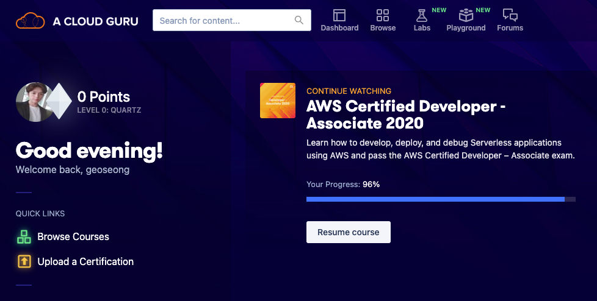

import Comment from '../../components/Comment';
import PostingDate from '../../components/PostingDate';

<PostingDate created={'2021/2/18'} modified={'2021/2/18'} />

[AD]

## 자격증 응시 계기

:::info
[AWS Community Builders](https://aws.amazon.com/ko/developer/community/community-builders/) 프로그램에 조인 한 것이 가장 결정적인 계기.
:::

필자는 [AWSKRUG](https://www.meetup.com/ko-KR/awskrug) [구로디지털모임](https://github.com/awskrug/gudi-group)의 오거나이저인데, 오거나이저의 혜택으로써 2020년 새로 런칭하게 될 [AWS Community Builders](https://aws.amazon.com/ko/developer/community/community-builders/) 프로그램 초창기 멤버로 참가하게 될 권한을 얻게 되었다.

그리하여 2020년 4월 즈음에 [AWS Community Builders](https://aws.amazon.com/ko/developer/community/community-builders/) 프로그램에 들어가게 되었다.

### AWS Community Builder 소개

[AWS Community Builders](https://aws.amazon.com/ko/developer/community/community-builders/) 프로그램은 지식공유와 기술 커뮤니티 활동을 열심히 하는 AWS 애호가에게 기술 리소스, 멘토링 및 네트워킹 기회를 제공한다고 소개되어 있다.

본격적인 AWS Community Builder 소개는 별도로 포스팅 하도록 하겠고,

AWS Community Builders 프로그램의 참가 혜택 중에 하나가 바로 `AWS 자격증 무료 응시권`과 함께 [`ACloudGuru`](https://acloudguru.com/) `1년 무료 이용권(2020년 10월)을` 제공한 것이다.

한동안 프론트엔드에 일이 치우쳐서 AWS를 일로써 다룬 지 까마득해질 무렵 이런 기회가 생겼으니... 공부 함 해볼까? 라는 마음이 생겨서 한번 자격증 시험에 도전 해 보기로 했다.

## Developer Associate 응시 결정

Developer Associate로 응시한 이유는 나는 순수 개발자로써 개발자 계통의 자격증을 따고 싶었는데, 그 중에는 Developer Associate, DevOps Engineer Professional이 존재했다.

이 둘 중에는 가장 하단에 존재해던 Developer Associate가 만만해 보여서(~~니가?~~), 여태 내가 AWS를 다뤘던 약 3년 반의 짬이 헛되지 않았다면 큰 노력 없이 딸 수 있을 것 같아서(~~하, 니가?~~) 선택을 하게 되었다.

## 시험 접수하기

너무 만만하게 보고 시험공부도 안하고 일찍 시험봤다가 떨어지면 자신감 하락할 듯 해서 2달 후에 시험을 치르기로 했다.

온라인 시험도 가능하지만, 웹캠이 있어야 하고, 시험 보는 장소가 완전 밀폐된 공간이어야 한다는 증명을 해 보여야 한다 하기에 귀찮을 것 같아 오프라인 시험을 보기로 정했다.

글로벌한 지도에서 한국의 시험장을 검색해서 선택해야 했는데, 양식이 너무 생소해 보여서 이게 정말 유효한 공식 시험장이 맞나 의심이 갔다.

그래서 우선 장소를 정해서 접수를 완료한 뒤에 해당 센터에 전화를 걸어 정말 여기서 AWS 시험 보는 것 맞냐, 코로나 때문에 갑자기 일정 취소되는 것은 아닌 지 물어보았었다 😅

## 시험 정보

- 섹션
    - 배포 22%
    - 보안 26%
    - AWS 서비스를 이용한 개발 30%
    - 리팩토링 10%
    - 모니터링 및 문제 해결 12%
- 시험과목 정보, 합격 정보
    - [AWS Certified Developer–Associate (DVA-C01) Examination Guide](https://d1.awsstatic.com/training-and-certification/docs-dev-associate/AWS_Certified_Developer_Associate-Exam_Guide_EN_1.4.pdf)
        - `1000점 만점에 720`점 되어야 합격
        - `과락 없음`
        - 시험시간 `130분`
        - 65문항
        - `시험결과 바로 나옴`
        - 시나리오 위주의 문항
        - `3년의 갱신기간`

 
[AD]
 

## 시험 공부하기

[AWS Community Builders](https://aws.amazon.com/ko/developer/community/community-builders/) 프로그램에서 받은 무료 수강권을 들고 **[ACloudGuru](https://acloudguru.com/)**를 들어가서 **`AWS Certified Developer - Associate 2020`** 강의가 있길래 들어가서 수강을 시작했다.

인강을 매일 하루에 한개 이상씩 보려고 노력했다. 총 강의가 약 130개가 되어서 강의가 밀리지 않도록 노력했고, 실제로 거의 매일마다 수강했다. 사실 한 강의당 10분이 채 되지 않는 강의가 꽤 되었기에 크게 심적인 부담은 없었다.

강의에서 추천한 시범 준비 리소스들을 알려주었는데, 내용이 근데 너무 방대한 것 같아서 이 내용들을 좀 소홀히 했다. 

- [Official AWS FAQ](http://aws.amazon.com/faqs) ([aws.amazon.com/faqs](https://aws.amazon.com/ko/faqs/))
- [AWS 백서(whitepaper)](https://aws.amazon.com/ko/whitepapers)
- AWS re:Invent Videos

다음에 자격증 준비하려고 하는 분들이 계시다면 적어도 AWS Technical Trainer님이신 [정도현](https://gist.github.com/serithemage) 님이 감사하게도 정리 해 주신 [AWS 공인 개발자 - 어소시에이트 수험 가이드](https://gist.github.com/serithemage/df61aaf396046eff7244b6eaa8d58d4a)의 내용을 한번 훑어 보는 것을 추천한다.

시험날짜 임박했을 때에는 **[ACloudGuru](https://acloudguru.com/)** 의 연습문제를 여러 번 풀어 보았고, [AWS Certification 시험 준비 홈피에서](https://aws.amazon.com/ko/certification/certification-prep/) 샘플 문항 PDF를 다운받아서 풀어 보았다.

생각보다 많은 문제를 틀려갖고 좀 마음이 불안해지기 시작했다 ㄷㄷ...😓

## 시험 당일

시험 당일이 되어서 난생 처음 가는 시험장소를 들어가서 문제를 풀었는데,

시험 공부할 때 소홀히 다뤘던 Step Functions 문제들이 3~4문제나 나와서 멘붕이 와버렸다. "나는 불합격한것같다" 라는 생각이 머릿속을 스치며,

시험 제출을 하는 순간,

바로 합격화면이 뜨는 것을 확인했다. 얼떨떨했다.

합격 화면을 보는 순간 긴장했던 기분이 녹아 내리면서 다행이다 라고 생각을 했다.

그렇게 후련한 마음으로 시험장을 나오게 되었다.

## 합격 인증하기

잠시 후에 CertMetrics 로부터 합격축하 메일이 왔다.

AWS training and certification 사이트에 로그인 해서 **인증(Achieved Certification)** 탭을 들어가 보니 필자가 합격한 히스토리가 나왔고, PDF로 합격증서를 다운받을 수 있었다.
또한 페이지 우측 버튼 중에 **내 디지털 배지에 액세스(Access My Digital Badges)** 를 누르면 디지털 배지를 등록할 수 있는 플랫폼인 [youracclaim.com](http://youracclaim.com)에 연결된다.

[youracclaim.com](http://youracclaim.com) 에서 회원가입을 하고, 뱃지를 등록했다.

그리고 SNS에 자랑하라고 친절하게 페이지도 마련되어 있다 ㅋ

시험 결과점수는 AWS training and certification 사이트의 **기록(Previous Exams)** 페이지에서 확인 가능하다

표에 **점수 보고서(Score Report)** 부분에 보면 pdf 문서를 다운받을 수 있다. 나는 851점을 맞아서 합격 했었다는 것을 알았다.

시험 결과 분석에서 `개선 필요`와 `역량 충족` 필드에 주황색 칠해진 필드가 아마도 O,X의 O의 역할을 하는 것이라고 한다.

처음에 봤을때는 글자나 숫자같은 것이 채워져야 하는 데 왜 없어? 문서가 잘못됐나 의심을 했었는데 그냥 필드 전체를 색으로 채워넣는 방식이 생소하다.

## Summary

- 넓은 범위로 오랫동안 다뤄보지 않았다면 절대 만만하게 보면 안됨
- 강좌 자료 구하는 법
    - 한글 강좌 및 만족할 자료 구하기 힘듦
    - 영문 강좌를 시청하면서 영어공부까지 덤으로 했다
    - 정도현님이 요약한 링크 공유
        - [AWS 공인 개발자 - 어소시에이트 수험 가이드](https://gist.github.com/serithemage/df61aaf396046eff7244b6eaa8d58d4a): AWS Technical Trainer 정도현님
    - 많은 사람들이 Udemy 강좌를 보는 것 같다
        - 강좌 평점 낮은 후기는 최신 서비스 내용을 잘 다루지 않는다는 내용..
        - ACloudGuru의 강좌 제작시점도 2018년이 최초였고, 최신 상태를 업데이트 하는 것이었음
- 시험 문제 풀 때 한글로 보면 용어가 생소한 것들이 많으니 영문으로 보는 것이 더 이해가 잘 될 듯
- 시험공부가 충분히 실무에 도움이 될 것 같다

[AD]

<Comment />
