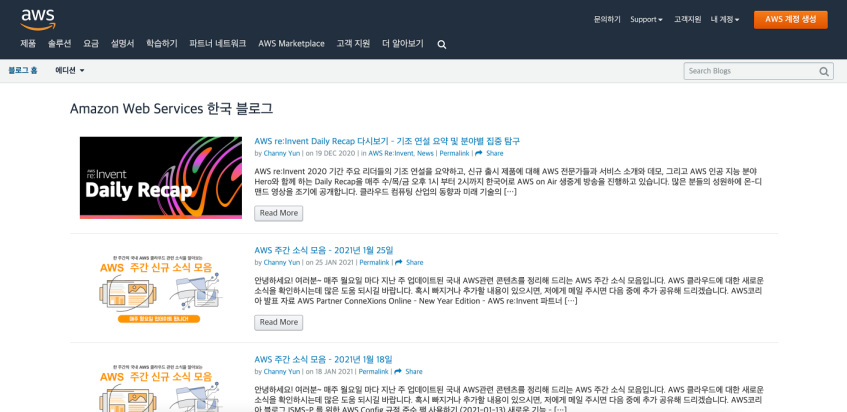
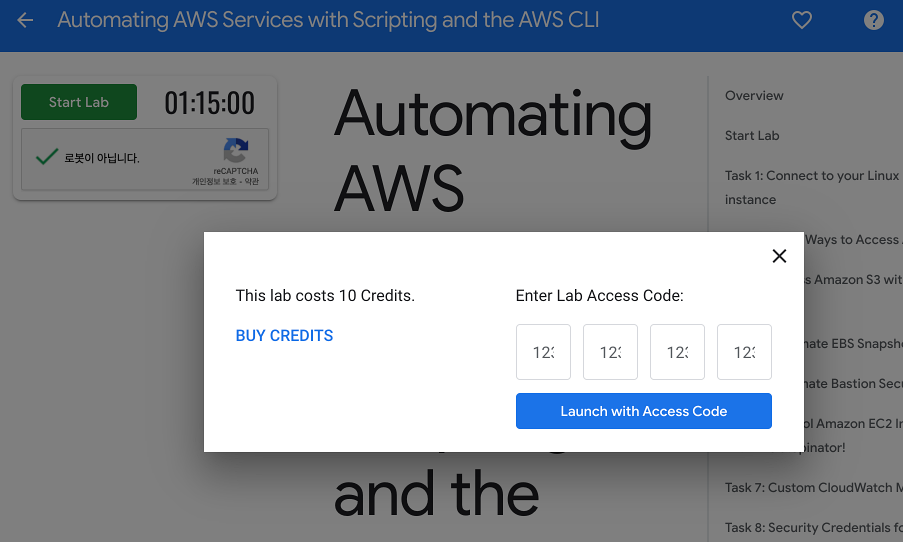
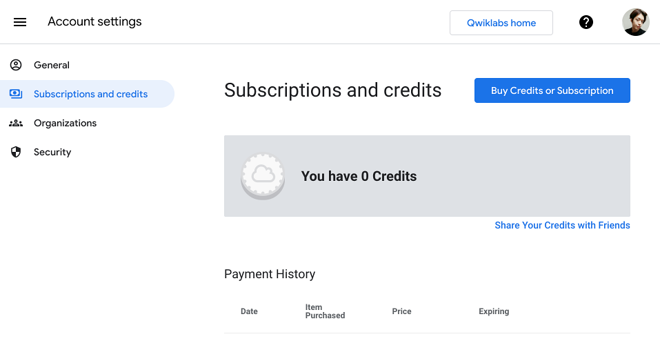
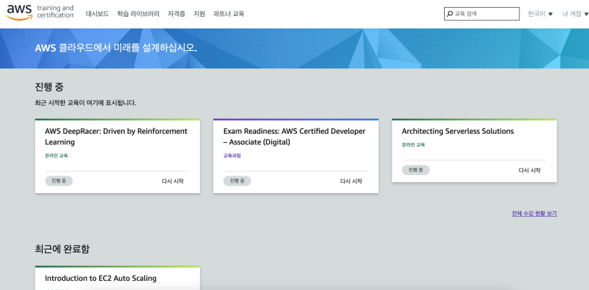
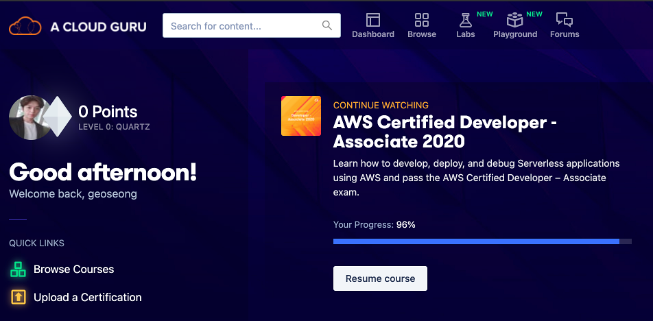
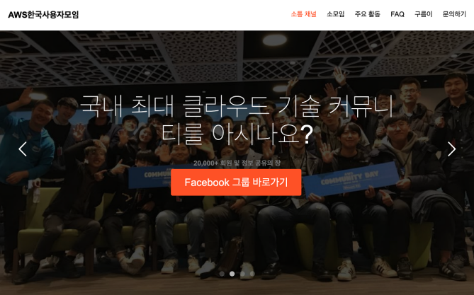
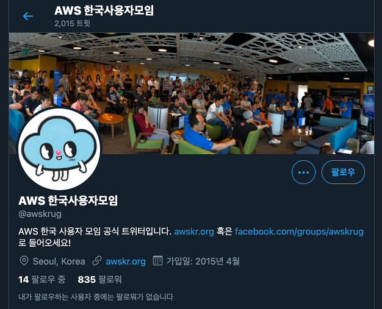

[AD]

## 소식 접하기
### Amazon Web Services 한국 블로그
[Go to Amazon Web Services 한국 블로그](https://aws.amazon.com/ko/blogs/korea/)

- 주기적으로 AWS 새로운 소식들을 접할 수 있음

## AWS 배우는 사이트
### AWS quiklabs
[Go to AWS quiklabs](https://amazon.qwiklabs.com/catalog)

- 구글의 코드랩과 비슷한 느낌
- 이건 무료 강의도 있지만, 꿀팁을 전수받을 만한 강좌들은 대부분 유료 크레딧을 요한다

### AWS Training and Certification
[Go to AWS Training and Certification](https://aws.amazon.com/ko/training/)

- AWS 공식 교육 및 자격증 과정 안내 및 소식을 볼 수 있음
- 페이지에서 "시작하기" 버튼을 누르면 본격적인 AWS 강의 페이지에 접속할 수 있다.
  - [Dashboard: AWS Training and Certification](https://www.aws.training/Dashboard)
    - AWS 공식 온라인(디지털 과정), 오프라인(강의실 교육) 교육 사이트
    - 무료 코스가 많다
    - Amazon 계정으로 로그인 해서 사용해야 함
      - 자격증을 따면 해당 계정과 연계가 되어서 "자격증" 페이지에서 확인 가능함

[AD]

## 자격증
### AWS Certification
[Go to AWS Certification](https://aws.amazon.com/ko/certification/)
- AWS 공식 자격증 과정 소개 페이지

### A Cloud Guru
[Go to A Cloud Guru](https://acloudguru.com/)
- 유료 클라우드 교육 플랫폼
- PC, 모바일 앱으로 교육 가능하고, 자격증 과정은 온라인 실전 모의고사 제공

## 커뮤니티
### AWSKRUG - AWS한국사용자모임

[Go to AWSKRUG - AWS한국사용자모임](https://awskrug.github.io/)
- 한국의 AWS 사용자 커뮤니티
- Facebook 그룹, Slack 채널, Meetup이 존재함을 소개하고 있음
- 주제별, 분야별 혹은 지역별로 다양한 소모임이 운영되고 있음
- 온/오프라인으로 사용자들이 운영하는 주기적인 모임이 운영되고 있음
- 운영진들끼리 모여서 매년 정기적으로 AWS Community Day 등 여러 행사를 주최하고 있음

### AWSKRUG Twitter
[Go to AWSKRUG Twitter](https://twitter.com/awskrug)
- AWS 한국 사용자 모임 공식 트위터
- 주간 소식 모음이 주기적으로 트윗되고 있어서 트윗 알람 설정 해놓으면 굳

[AD]