import Comment from '../../components/Comment';
import PostingDate from '../../components/PostingDate';

<PostingDate created={'2024/11/27'} modified={'2024/11/27'} />

[AD]

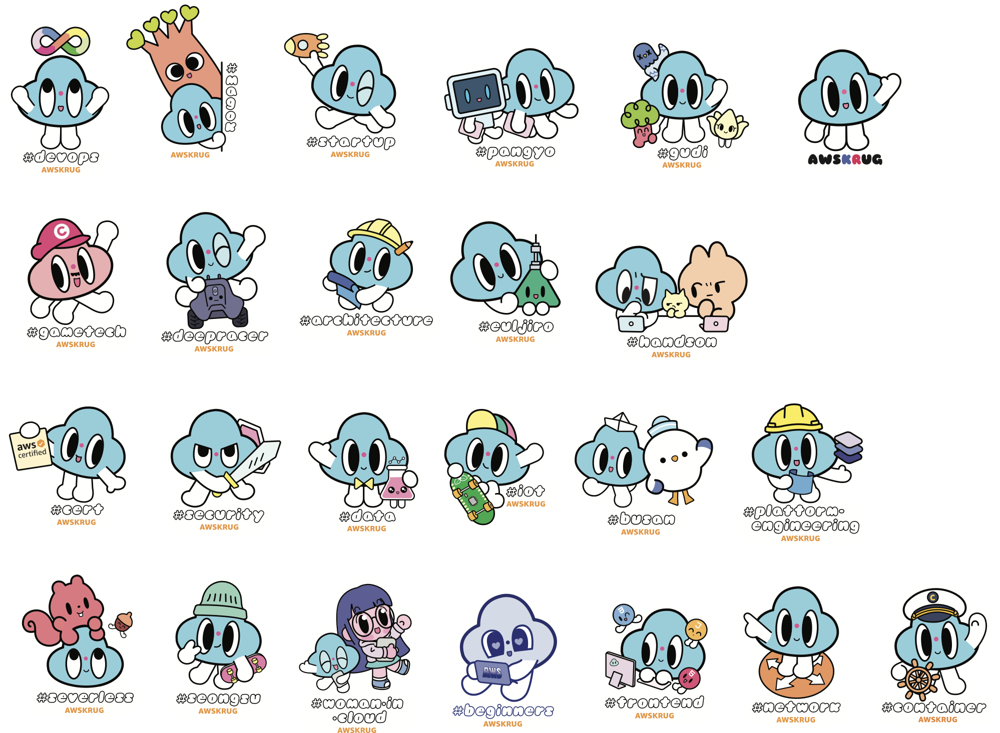

안녕하세요! 이번 글에서는 제가 2024년 한 해 동안 참여했던 AWSKRUG(AWS Korea User Group) 커뮤니티 활동들을 정리해 보려고 합니다.

AWSKRUG 커뮤니티 활동은 항상 저에게 동기부여와 긍정적인 에너지를 주었고, 글로벌 개발자들과 소통할 수 있는 귀중한 경험을 안겨주었습니다.

또한 키노트 스피커로 나서서 여러 사람들에게 적극적인 커뮤니티 활동을 통해 국내를 넘어 세계무대로 나가보자는 목소리를 내기도 하였습니다.

이 외에 여러 행사에 부스 스탭으로 참가하여 AWS 커뮤니티 및 AWSKRUG에 대해 많이 알렸습니다.

그럼 올해 제가 참여했던 주요 활동들을 살펴볼까요?

## 주요 활동

### AWSKRUG 밋업 12회 개최

올해는 총 12회의 AWSKRUG 밋업을 진행했습니다.

**구로 디지털 단지(서울 내 지역) (#gudi)** - 3회

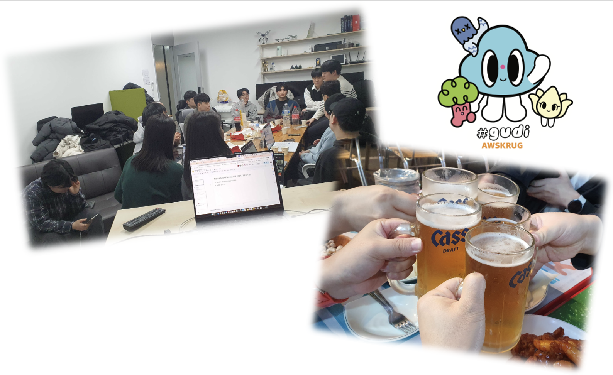

- 구로디지털단지 소모임은 2017년부터 운영되어 온 지역 소모임입니다. 근처에서 일하는 사람이나 근처에 사는 사람들이 편하게 참가해서 네트워킹하는 분위기를 만들었습니다.
- 많은 인원을 수용할 수 있는 장소를 구하기가 어려워서 작지만 아늑한 분위기의 제가 다니는 회사 사무실에서 소규모로 진행하고 있습니다.

 

**게임테크 (#gametech)** - 3회

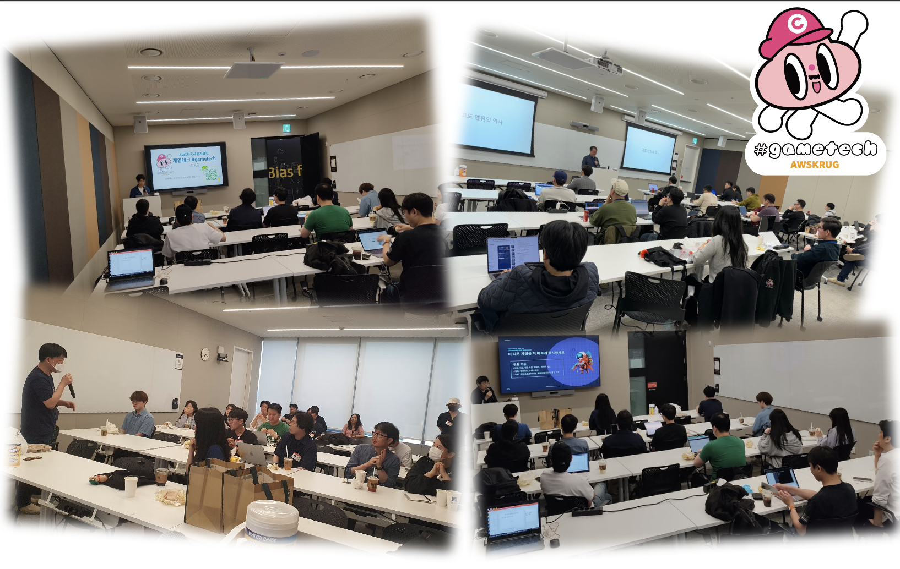

- 게임테크 소모임은 현재 AWS 코리아 오피스에서 장소대여를 하여 진행중인 AWS 게이밍 및 게임테크에 대한 주제를 다루고 있는 모임입니다.
- AWS 게임팀과 함께 운영을 하고 있어서 가끔씩 AWS 게임팀에서 기술세션을 열어주기도 합니다.

 

**프론트엔드 (#frontend)** - 6회

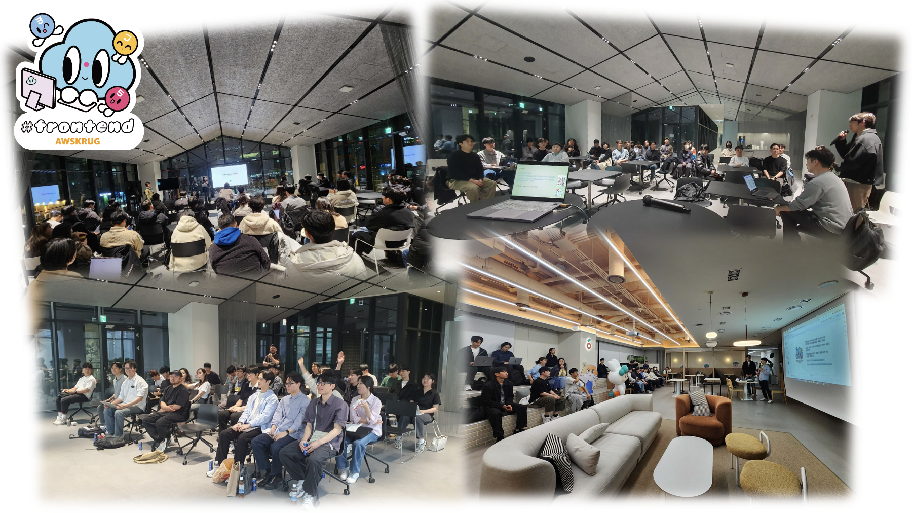

- 프론트엔드 소모임은 스핀오프된 모임으로써 모든 프론트엔드 테크에 대한 주제를 다루고 있습니다.
- 참가자 남녀성비가 가장 균형있게 유지되고 있고, 젊은 분들이 많다보니 발표지원도 많이 들어오고 질문도 많고 적극적인 태도를 보여주고 있습니다.
- 이런 적극적인 사람들과 네트워킹 분위기를 형성하려는 운영진들의 분위기가 잘 맞아서 매 소모임 이벤트때마다 약 50~60명의 많은 분들이 참석하고 있습니다.

위의 소모임들에서 저는 주로 호스트로 활동하며 처음 참석한 분들을 어색하지 않게 분위기를 이끌어가려 노력했고, 신규 모임 운영진들을 돕는 역할을 했습니다.

또한 세미나 형태의 발표시간 뿐만 아니라, 한 주제를 놓고 참가자들끼리 토론하는 시간도 가져보았습니다.

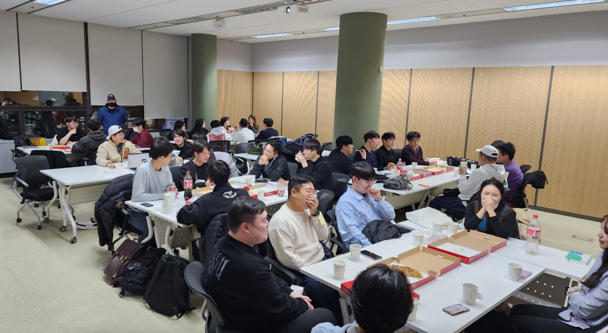

이벤트 중 간식시간 배치에 대해 고민도 해보았습니다. 참가자들이 보다 더 편안한 분위기에서 다양한 사람들과 네트워킹을 할 수 있는 시기가 언제일까 고민하면서 간식시간을 모임 초반에도 해보고 모임 중간, 후반에도 해보았었습니다. 결론을 100% 짓진 못했지만 확실한 것은 간식시간은 모임 중간 혹은 후반때 배치하는 게 모임 초반에 하는것보다 훨씬 낫다 라는 것이었습니다. 왜냐하면 모임 초반에는 낯선 장소에 낯선 사람들과 만나는 초반이기 때문에 네트워킹을 위한 준비도 되지 않은 상태라 많은 사람들이 어색해 하는 것을 느낄 수 있었기 때문입니다.

[AD]

 

### 5월 - AWS Summit Seoul

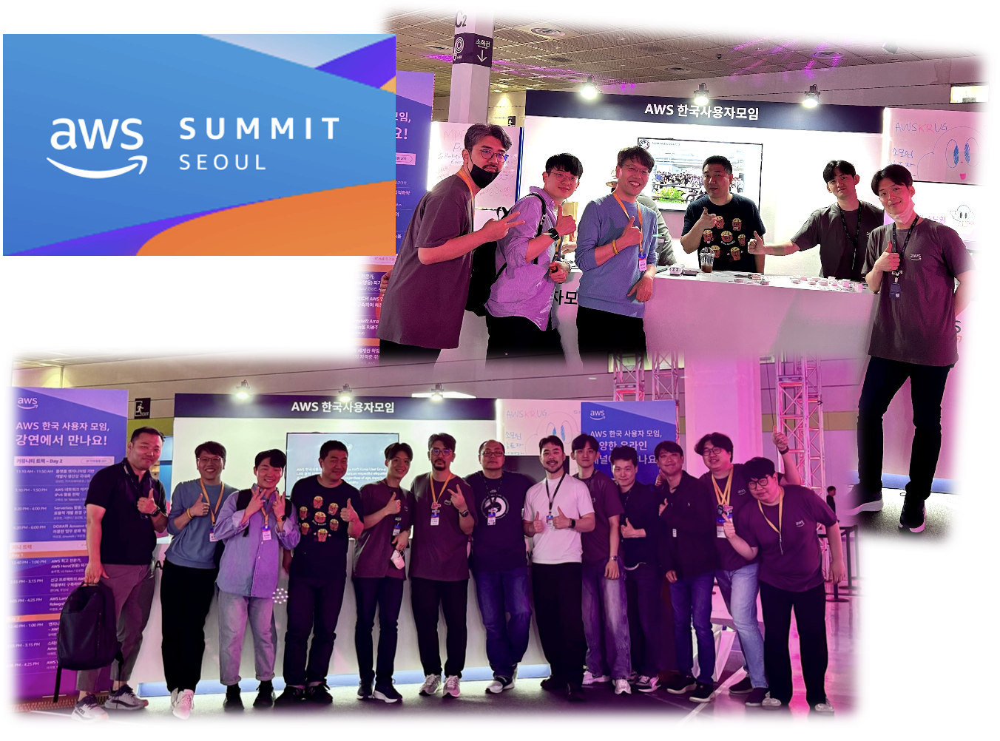

5월에 열린 AWS Summit에서 커뮤니티 부스를 지원하며 AWSKRUG을 처음 접하는 분들께 커뮤니티를 소개하는 시간을 가졌습니다. 새로운 참석자들에게 커뮤니티의 역할과 활동을 안내하면서, 많은 분들의 관심과 참여를 이끌어냈습니다.

 

### 7월 - AWS Heroes Summit 참석

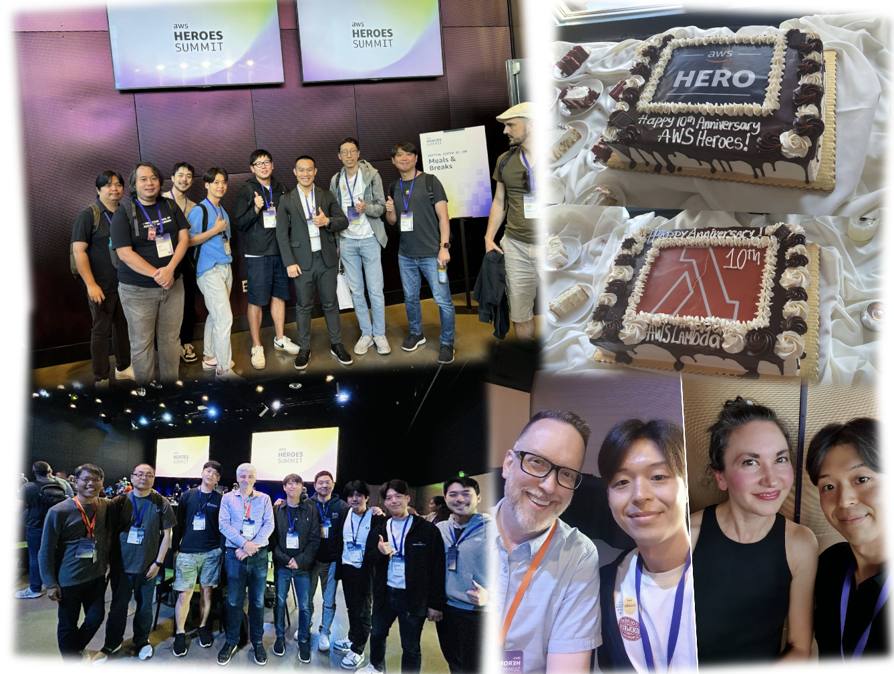

7월에는 AWS Hero 커뮤니티 프로그램 초청으로 시애틀에서 열린 AWS Hero Summit에 참석했습니다.

저는 용기를 내어 전 세계의 AWS Hero들과 이야기를 해 보며, 각국에서 밋업이 어떻게 운영되는지에 대해 논의했습니다.

여기서 가장 크게 느꼈던 점은 한국 참가자들이 보다 적극적으로 네트워킹하면 커뮤니티에 큰 도움이 될 것이라는 생각을 하게 되었습니다. 이러한 경험을 바탕으로 한국 유저 그룹과 글로벌 밋업 운영자 간의 협업 가능성에 대해 깊이 고민하게 되었습니다.

 

### 9월 - AUSGCON 키노트 발표

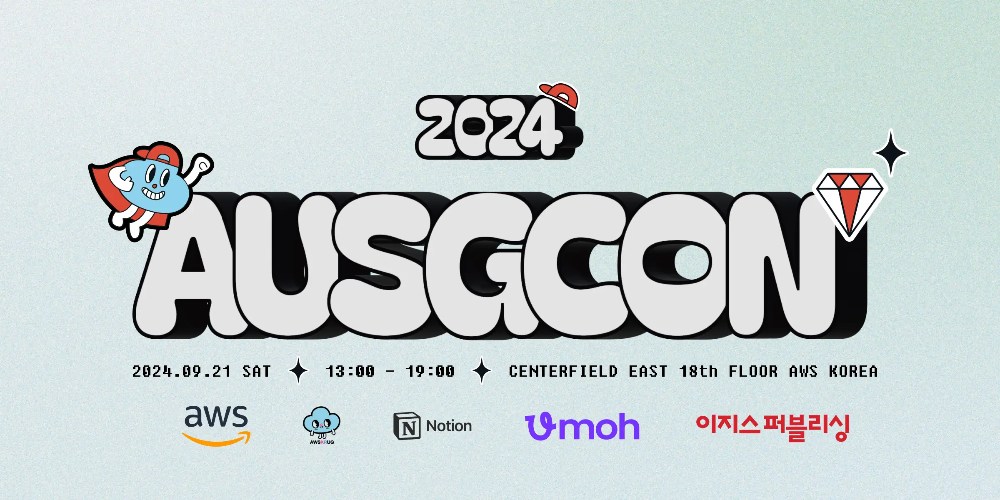
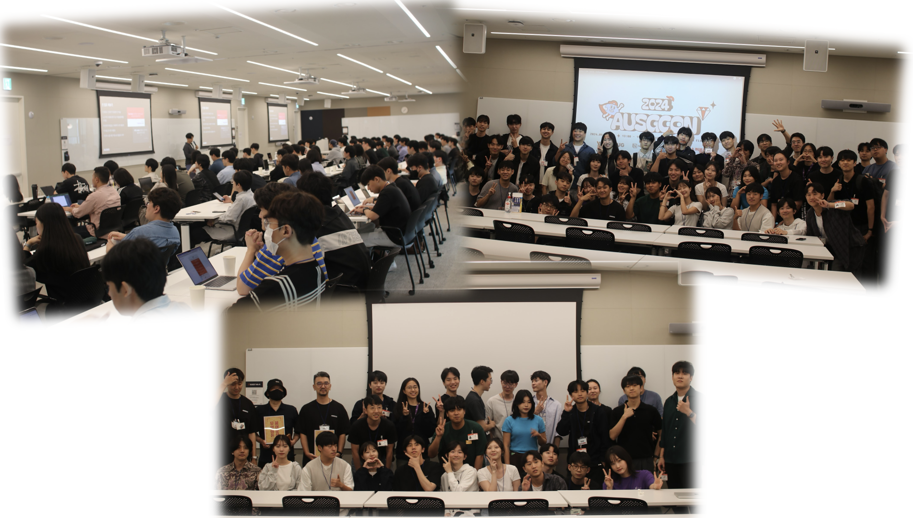
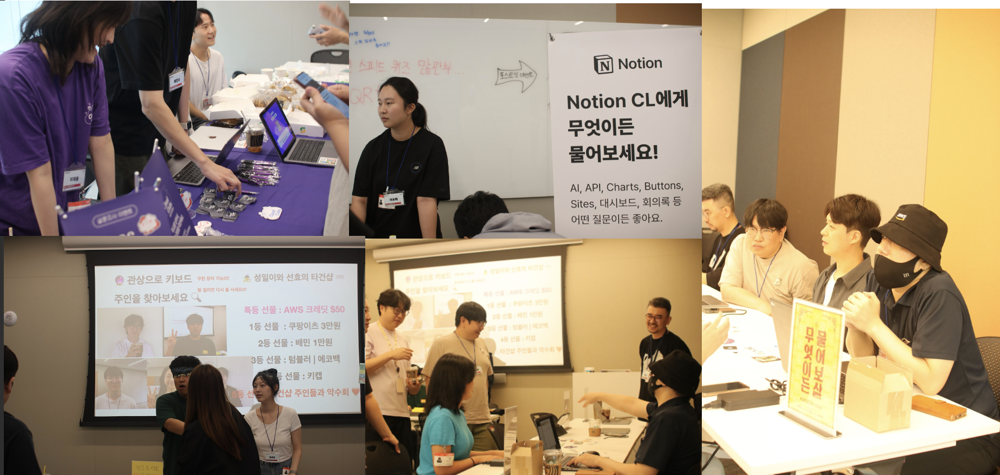

9월 21일에 AWS University Student Group이 주최한 AUSGCON에서 키노트 스피커로 참여하였습니다.

저는 키노트 시간에 커뮤니티 활동이 가진 무한한 가능성과 적극적인 참여를 독려하였고, 국내를 넘어 세계로 나가보자는 내용의 발표를 진행했습니다.

학생들이 커뮤니티에 쉽게 다가갈 수 있도록 영감을 주고, 참여를 장려하는 뜻깊은 시간이었습니다.

[AD]

 

### 10월 - KWDC24 커뮤니티 파트너 스태프

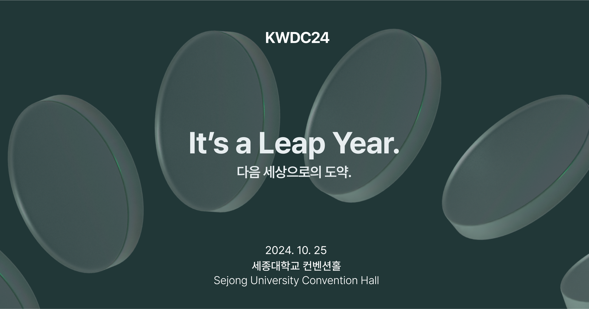
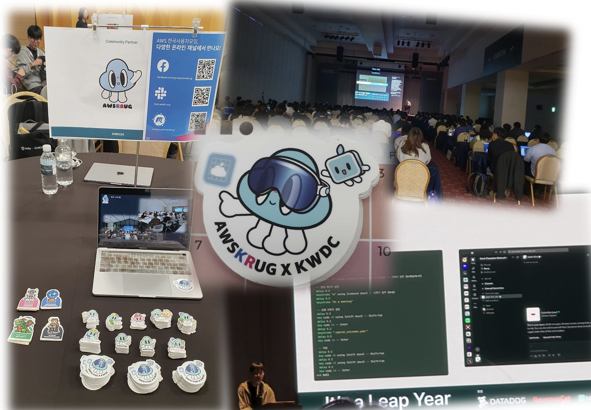

10월 25일에 한국 세종대학교에서 열린 **대한민국 최대의 Apple 생태계 컨퍼런스 KWDC24** 에서 AWSKRUG가 커뮤니티 파트너로 참가하게 되었습니다.

이 컨퍼런스에는 AWSKRUG 소모임에 참가했던 참가자와 을지로 소모임의 운영자께서 KWDC24의 발표자로 참가하기도 했는데요, 발표가 끝나고 저희 부스로 찾아왔는데 반가웠습니다.

그리고 옆에 부스에는 Seoul iOS meetup 커뮤니티가 있었는데요, 이 모임의 운영자가 작년부터 AWSKRUG 소모임에 여러번 참가하고 발표도 했었던 프랑스 개발자입니다. 참가자로 보다가 각 모임의 대표로 만나게 되어서 색다른 느낌이었고 많이 반가웠습니다.

KWDC24 의 참가자들 중에서는 한국에서 개최되는 컨퍼런스 치고는 외국인들의 비중이 높은 편이어서 흥미로웠습니다. 그리고 AWSKRUG 부스를 방문한 외국 참가자들에게 AWS 커뮤니티에 대해 알려주었습니다.

여러 참가자들이 저희 부스를 보고는 AWS가 iOS 관련 생태계가 있느냐는 질문을 많이 하였는데, 저는 “AWS iOS SDK, AWS SDK for Swift가 있을 뿐만 아니라, EC2 Mac 인스턴스도 존재한다”고 열심히 설명을 했습니다.

특별히 외부 컨퍼런스에 참가한 만큼 우리 측에서 KWDC용 스티커를 제작하여 나눠주기도 하였습니다.

 

### 11월 - **커뮤니티 데이 부스 스태프**

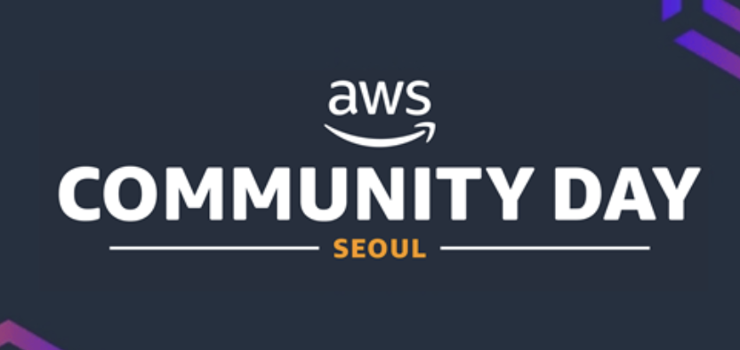
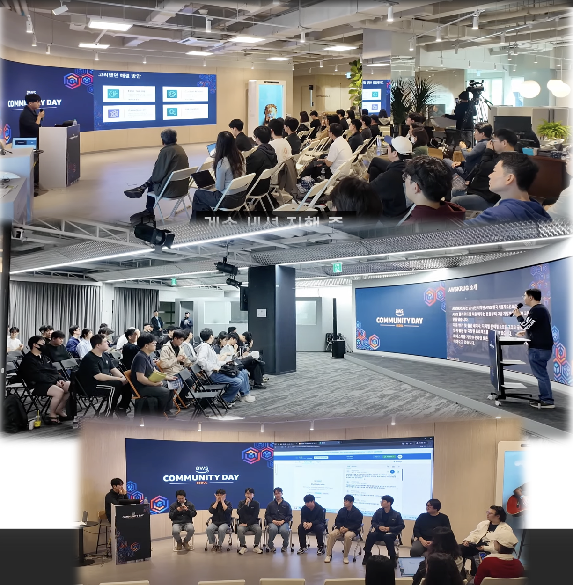
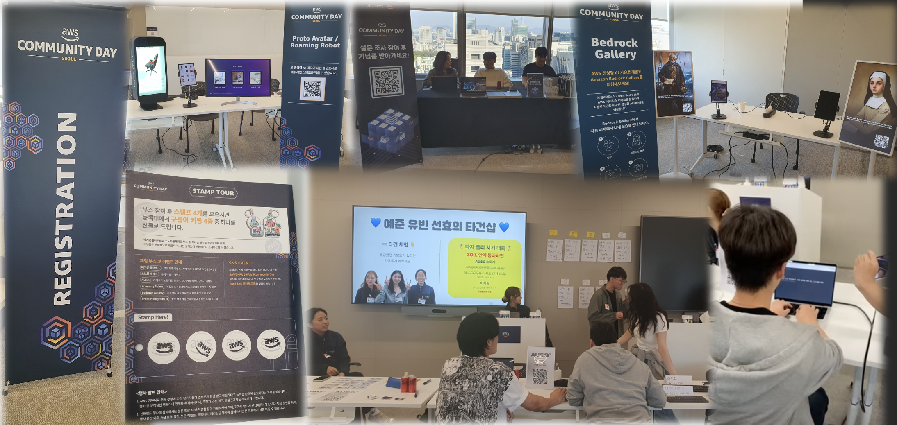

11월에는 커뮤니티 데이 행사에서 부스 스태프로 활동하며 참가자들을 돕고 안내하는 역할을 맡았습니다. 많은 참가자들에게 AWSKRUG의 다양한 활동을 알리고, 소통할 수 있는 시간이었습니다.

여기서 스피드 타이핑 챌린지가 열렸는데, 여러 수많은 참가자들을 제치고 제가 1등을 차지해 버렸습니다. 사실 행사 시작 전 테스트로 해보았었는데, 다른 사람들이 제 타이핑 속도를 보고 감탄하면서 행사 중간마다 다시한번 쳐달라는 요청을 해왔습니다. 그래서 여러번 더 시도하게 되었는데, 제가 타이핑을 할때마다 제 기량이 늘어나는 바람에 제 기록을 계속 경신해 버려서 다른 참가자들에 민폐를 끼치게 되었습니다.

제가 스탭들에게 제 기록은 포디움에 올리지 말아달라고 했지만, 이 기록은 알려야 한다며 제 기록을 순위에 올려주었습니다. 민망하기도 하였지만 다른 사람들이 감탄하니까 기분이 좋기도 했네요.

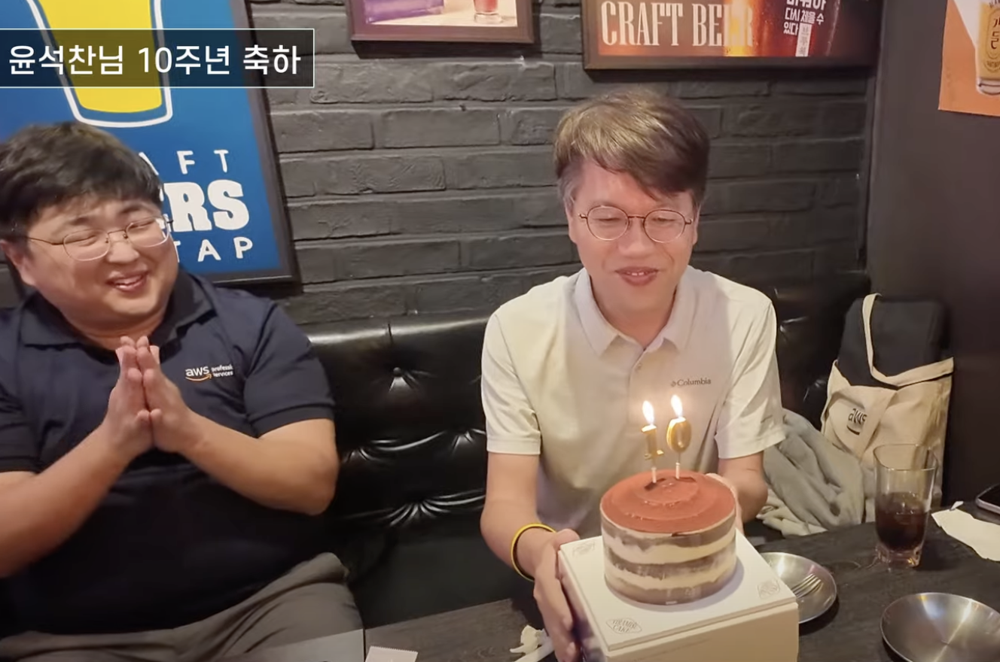

그리고 커뮤니티 데이가 있던 날은 테크 에반젤리스트이신 윤석찬 님의 AWS 입사 10주년 되는 날이었습니다. 행사가 끝나고 뒷풀이 시작 전에 커뮤니티데이 준비 스탭들이 서프라이즈 이벤트로 케이크를 사서 석찬님의 입사 10주년을 축하해 주었습니다. 모두가 기뻤던 순간이었네요!

[AD]

 

## 앞으로의 계획과 목표

### re:Invent 2024 참석

라스베이거스에서 열리는 AWS re:Invent에 참석하여 다수의 세션과 커뮤니티 이벤트에 참여할 예정입니다. 작년에 처음 참가를 했었는데, 엄청난 스케일과 인사이트를 얻었고 글로벌 멤버들과의 소통을 할 수 있는 것에 큰 인상을 받았는데 올해도 기대가 많이 됩니다.

이번년도에는 Expo 안의 Community Developer Lounge에서 Staff 을 맡게 되었습니다. 화요일 오후 2시에서 3시까지 Welcome Desk에 지원을 하였는데, 만나는 사람들과 반갑게 얘기할 생각에 행복합니다.

이곳에 AWSKRUG 스티커 다양하게 많이 챙겨갈 예정이니 기대해 주세요.

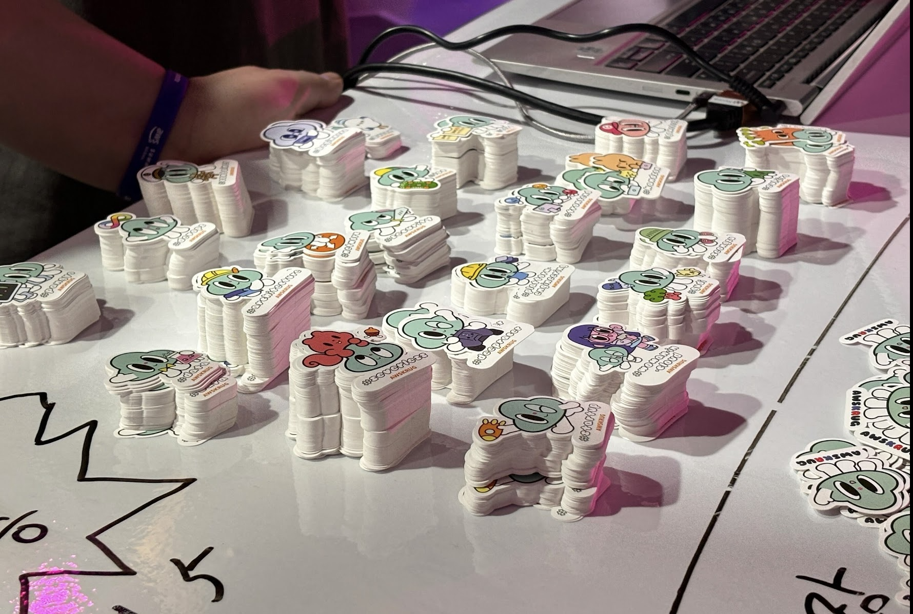

 

### AWSKRUG 운영진 송년회 (12월 27일)

AWSKRUG 밋업 운영진들과 연말 모임을 가질 예정입니다. 이 자리에서 한 해를 돌아보고 내년의 전략을 논의하려고 합니다.

개인적인 바람은, 글로벌 커뮤니티와의 협업을 통해 더 많은 사람들이 글로벌 커뮤니티 활동에 참여할 수 있는 기회를 만들었으면 합니다. 단, 저 포함 모든 멤버들이 각자의 회사에서 일을 하고 있는 만큼 서로의 업무에 무리가 가지 않는 선에서 커뮤니티 활동을 잘 했으면 하는 바람도 있습니다.

## 마무리하며

2024년은 저에게 있어 다시금 커뮤니티가 저에게 행복한 에너지를 준다는 것을 깨닫게 한 한 해였습니다. AWS Global Community와 AWSKRUG에서 얻은 에너지와 영감은 제가 더 나은 커뮤니티 활동을 계획하고, 실행하게 하는 원동력이 되었습니다. 앞으로도 다양한 사람들과 소통하며 더 큰 가치를 만들어가고 싶습니다.

이 자리를 빌려 AWS 커뮤니티 프로그램 코디네이터분들께도 감사의 마음을 전하고 싶습니다. 여러분의 지원 덕분에 커뮤니티 활동이 더 풍성해질 수 있었습니다.

감사합니다.

[AD]

<Comment />
