import Comment from '../../components/Comment';
import PostingDate from '../../components/PostingDate';

<PostingDate created={'2022/3/05'} modified={'2021/3/05'} />

[AD]

## 무료 응시 기회 얻기

먼저 [Microsoft Azure Virtual Training Day](https://www.microsoft.com/ko-kr/events/training-days) 사이트를 통해서 강의 스케쥴을 확인하고 수강 신청을 한다.

:::tip
선착순이므로 늦게 신청하면 등록이 마감되었다고 안내가 나오니 면밀하게 확인 할 것
:::

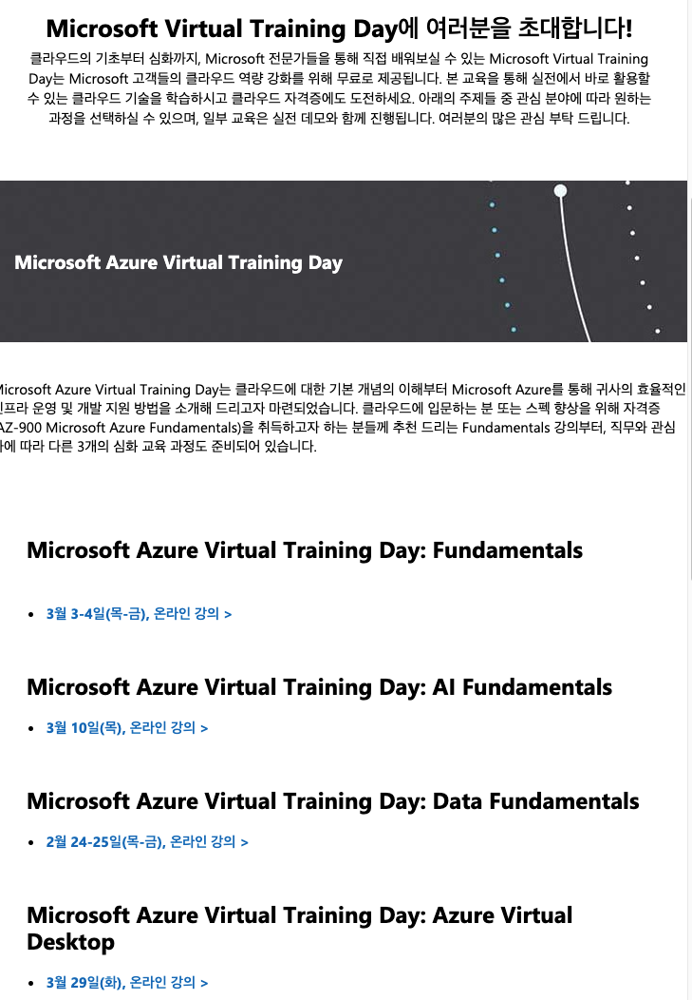

DP-900 은 Data Fundamentals 수업이었고, 2일짜리였다. 오후 2시에 보통 시작해서 2시간 30분 정도 한다.

수강신청이 완료되면 강의 스케쥴 이메일이 날라오고, 온라인으로 수업을 듣는다.

웨비나 2일 교육을 모두 듣고 나면 3~4일 후에 아래 이메일이 날라오고 무료로 시험을 볼 수 있는 혜택을 받을 수 있다.

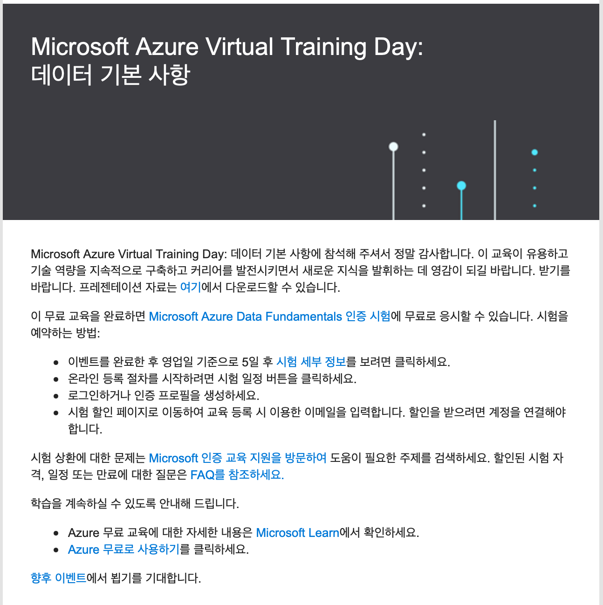

## 시험공부

:::info
[examtopics - 덤프 사이트: Microsoft DP-900 Exam](https://www.examtopics.com/exams/microsoft/dp-900/)
:::

[examtopics](https://www.examtopics.com/exams/microsoft/dp-900/)라는 덤프 사이트를 우연히 발견해서 문제 답만 외운 게 아니라 MSDN 문서까지 보면서 대략적인 개념을 정리하면서 공부했다.

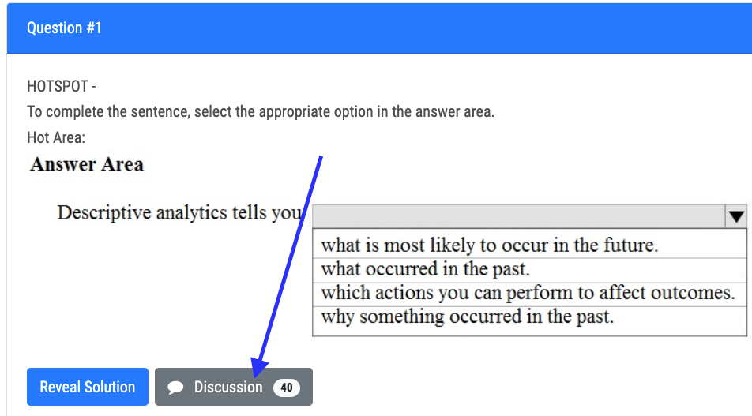

위 스샷에서 `Reveal Solution`을 통해서 정답을 확인 할 수 있지만 가끔 올라가 있는 문제에 대한 답이 다른 경우도 있었다. 때문에 문제 아래에 있는 `Discussion`버튼을 열어 봐서 다른 사람들이 남긴 댓글들을 보면서 잘못된 지식을 바로 잡아야 한다. 가끔은 답이 어떤 것인 지 의견 통일이 안되는 문제도 있기 때문에 내가 직접 알아보아야 하는 경우도 있다.

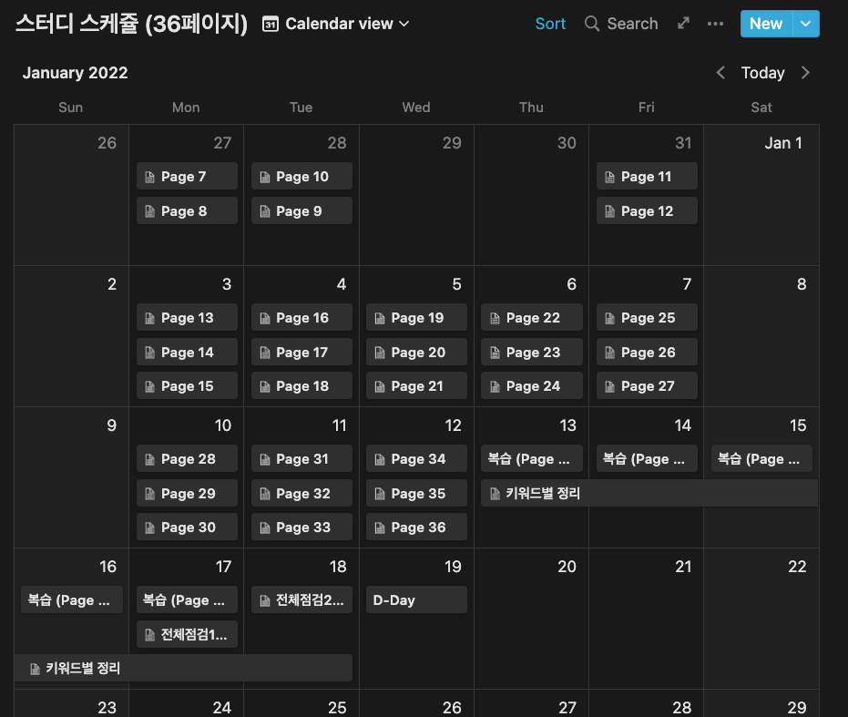

노션의 캘린더 기능을 적극 활용해 가지고 일 끝나고 매일 공부할 범위 정해가지고 스케쥴을 지키면서 해 보았다. 진짜 이렇게까지 짜임새있게 계획 짜고 열공하는 건 태어나서 처음이었던 것 같다.

이렇게 매일마다 1~2시간씩 한달간 열공을 했던 것 같다.

## 1차 시험(1/19)

드디어 그날이 와서 자신있게 시험장에 들어갔다.

AWS Associate Developer 시험을 본 장소였기 때문에 나에게 익숙한 곳이었고, Azure 시험 인터페이스는 AWS와는 완전 다르네, 흰 배경에 산뜻하네..하면서 한 문제를 가볍게 풀었다.

그리고 아래 그림들은 내가 시험장소에서 보았던 UI를 뇌피셜로 그린 것이니 느낌 참고만 할 것..

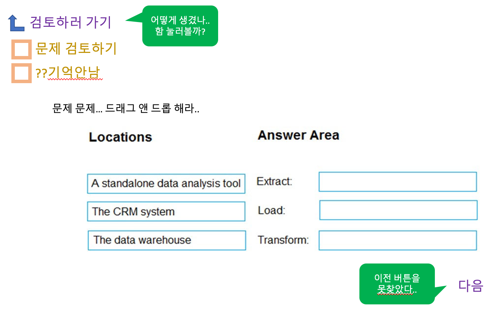

왼쪽 상단에 문제 검토버튼이 있어서 아 문제에 마킹을 해 놓고 다 푼 다음에 검토하는 페이지구나 하면서 호기심에 그냥 들어가 봤는데, 검토 창에서 다시 문제 화면으로 어떻게 돌아가야 하는 지 모르겠는 것이었다..

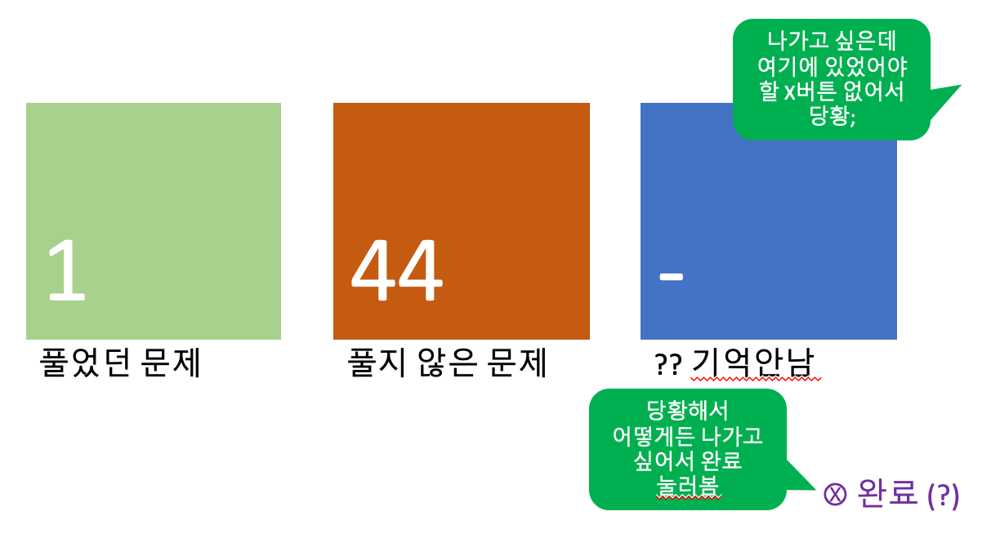

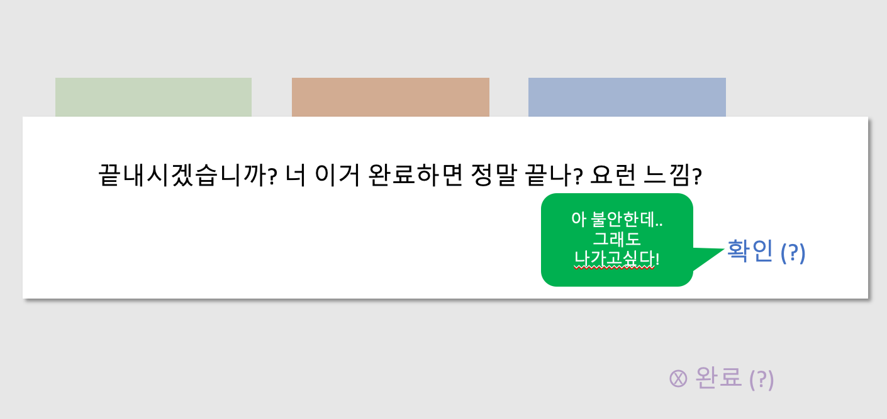

도무지 모르겠어서 검토 화면을 닫으려다 완료를 눌러 버렸는데,

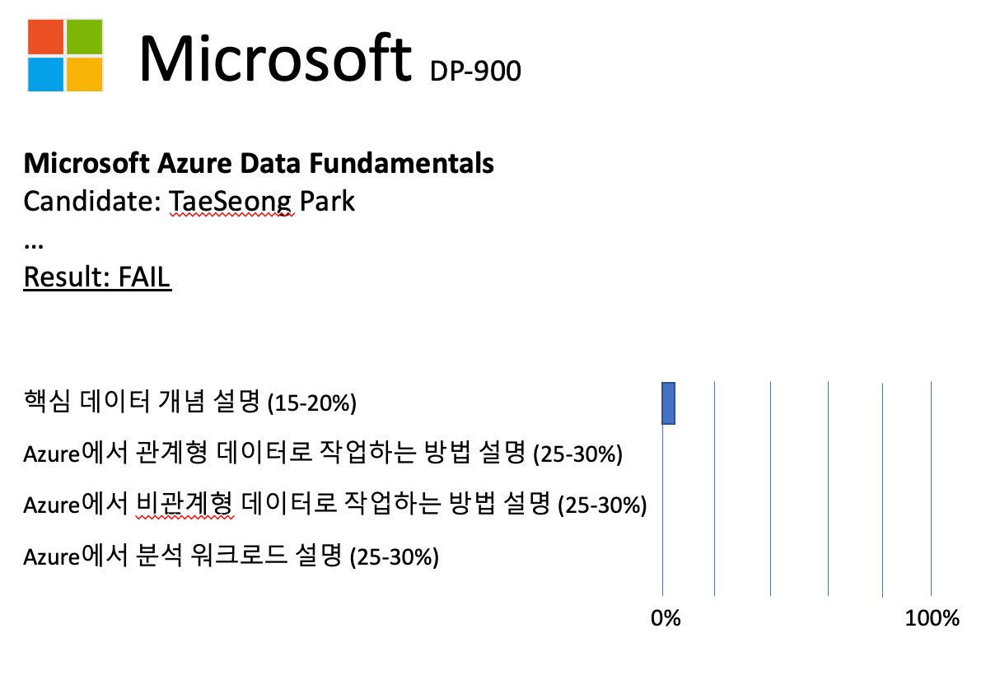

이렇게 5분만에 불합격 처리가 되었다.. 내 한달간의 노력...ㅠㅜ

### 다시한번 기회를 주세요..

감독관에게 가서 이거 어찌하다가 시험이 끝나버렸는데 다시 시험 칠 수 있나요? 라고 물어봤는데, 이전에도 같은 케이스가 있어서 문의해 봤는데, 응시자 과실로 처리되었다고 하였다.. 억울한 맘으로 시험장을 나왔다..

하루 후에 Microsoft Certification에서 메일이 날라왔다.

:::info
[시험 재응시 정책](https://docs.microsoft.com/ko-kr/learn/certifications/exam-retake-policy)
:::

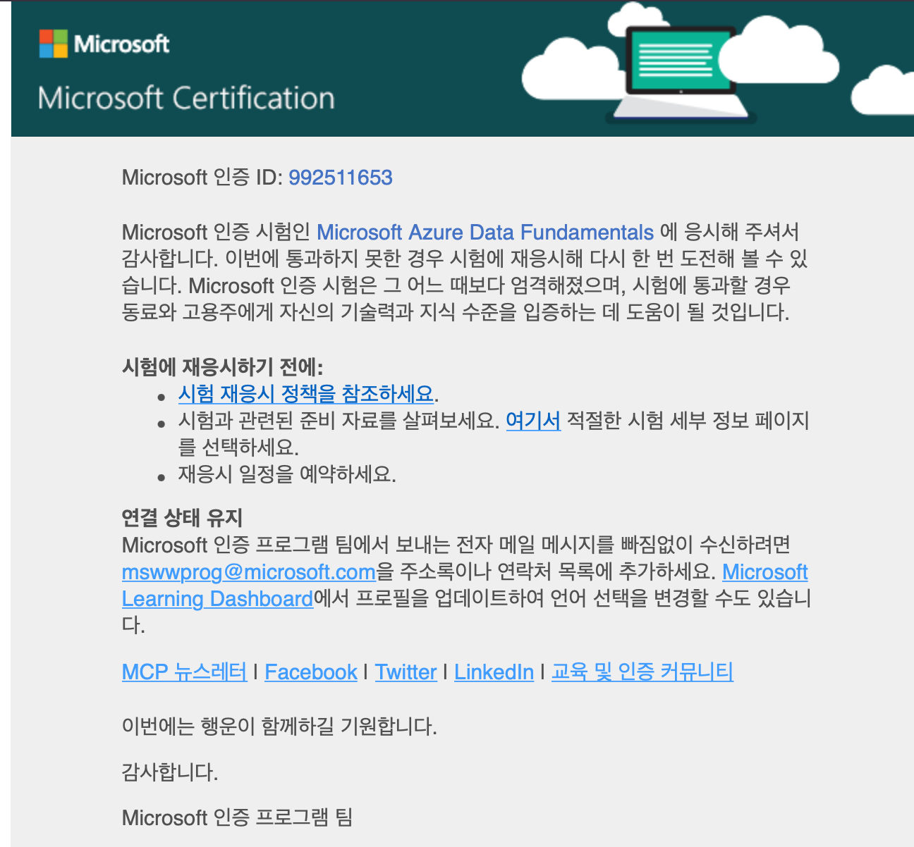

### 시험 재응시 예외 요청 제출

아래 안내사항을 읽고 예외요청을 한번 해 보기로 했다

:::caution  
필수 시간을 기다리지 않고 시험에 재응시하려면 예외 요청을 제출해야 합니다. 아래에 나열된 예외 중 하나를 충족하는 경우 요청이 승인됩니다. 시험 불합격이 응시자의 준비, 지식, 기술 또는 능력 부족으로 인한 경우 재응시 예외는 승인되지 **않습니다**.

[mlsecure@microsoft.com](mailto:mlsecure@microsoft.com)에 요청을 제출하세요. 요청에는 다음 정보가 모두 포함되어야 합니다.

- 성 및 이름.
- 응시자 ID.
- 응시자 ID와 연결된 메일.
- 시험 등록 ID.
- 시험 번호.
- 오류에 대한 설명.
- Pearson VUE 사례 번호.

이 정보 중 **하나** 라도 누락된 경우 재응시 예외 요청이 거부됩니다.
:::

### 시험 재응시 예외의 타당한 사유

- 랩 크래시로 인한 불합격
- 인터넷 연결 문제로 인한 불합격
- 장비 고장으로 인한 불합격

나는 사실 위의 케이스에 해당이 되지 않아서 메일을 보내야하나 말아야 하나 고민을 했지만.. 일단은 한번 보내 보기로 했다.

### 재응시 메일 보내다

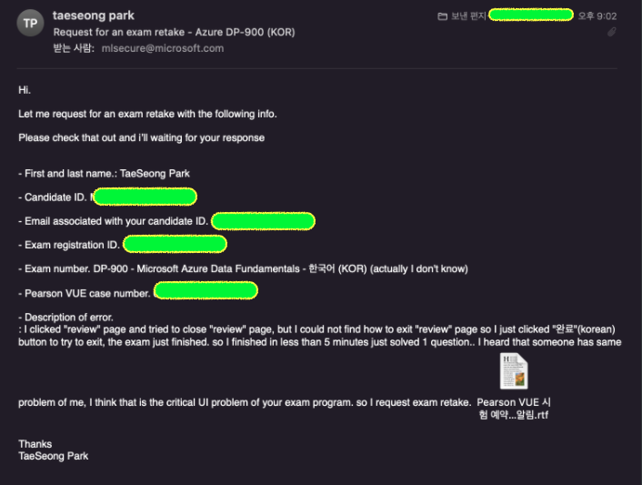

답이 왔는데.. 무성의한 답변이다. 저 Pearson VUE customer service 사이트는 연락처만 알려주고 있는데,

사실 연락해도 소용 없다 생각 한 게 감독관이 시험 당일날에 한번 전화를 했던 것 같고, 이거는 시험자 과실이라서 안된다고 답을 받았던 기억이 나서 그냥 여기까지만 하기로 했다.

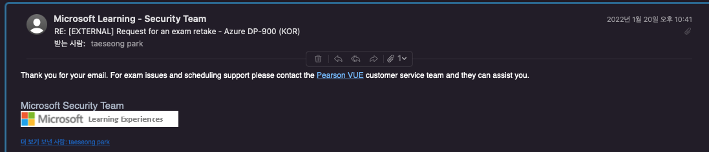

### 시험 프로그램 데모 보기

아쉬운 마음에 PearsonVUE 사이트에서 이것저것 기웃대다가 시험 프로그램 데모를 한번 봤었는데 검토에 대한 메뉴는 찾아볼 수 없었다... 아놔...

AWS가 딱 이렇게 생겼었는데.. Azure는 달랐다.

:::info
[응시자 :: Pearson VUE 한국](https://korea.pearsonvue.com/test-taker.aspx)
:::

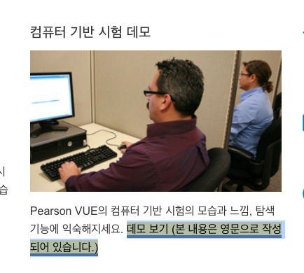

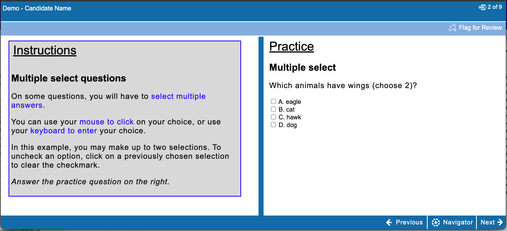

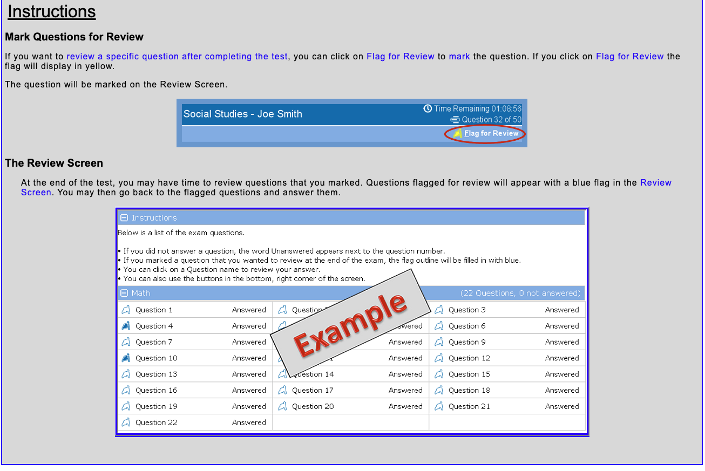

## 2차 시험(3/2)

이번에는 2/24~2/25일에 `Microsoft Azure Virtual Training Day: 데이터 기본 사항 1` 교육을 수강하고 2/28일에 이메일이 와서 무료 시험 응시 안내를 받은 뒤에 PearsonVUE를 통하여 시험접수를 다시 했고, 영문 버전으로 시험 접수를 했다.

시험장에 가서 보니까 인터페이스와 한글버전을 봤을때와 다르고, 처음 시험 봤을때와 다르게 뭔가 좀 더 친숙해진 인터페이스 느낌이 들었다.

크게 다르다고 느꼈던 것은 시험 보는 중에 이전 문제로 돌아갈 수 있는 버튼이 있다.. 이거는 괜히 한번 뒤로 갔다가 앞으로 갔다가 해 봤다. 그치만 동시에 내가 이미 풀었던 문제의 답안지가 초기화 되는거 아냐? 라고 괜히 덜덜 떨었고..ㅎ

1차때 어이없는 버튼클릭 실수로 떨어졌기 때문에 왠만하면 이것저것 건드리지 않으려 노력했다..;

그 결과,

### 합격

한 2문제 정도 틀린 것 같다.
공부했던 덤프 사이트에 있는 문제가 거의 토씨하나 안 틀리고 대부분 그대로 나왔었고, 아주 새로운 문제 한 개와, 너무 쉬운건데 헷갈렸던 개념 관련된 문제 한 개 이렇게 두 개를 틀린 것 같다.

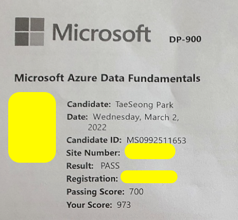

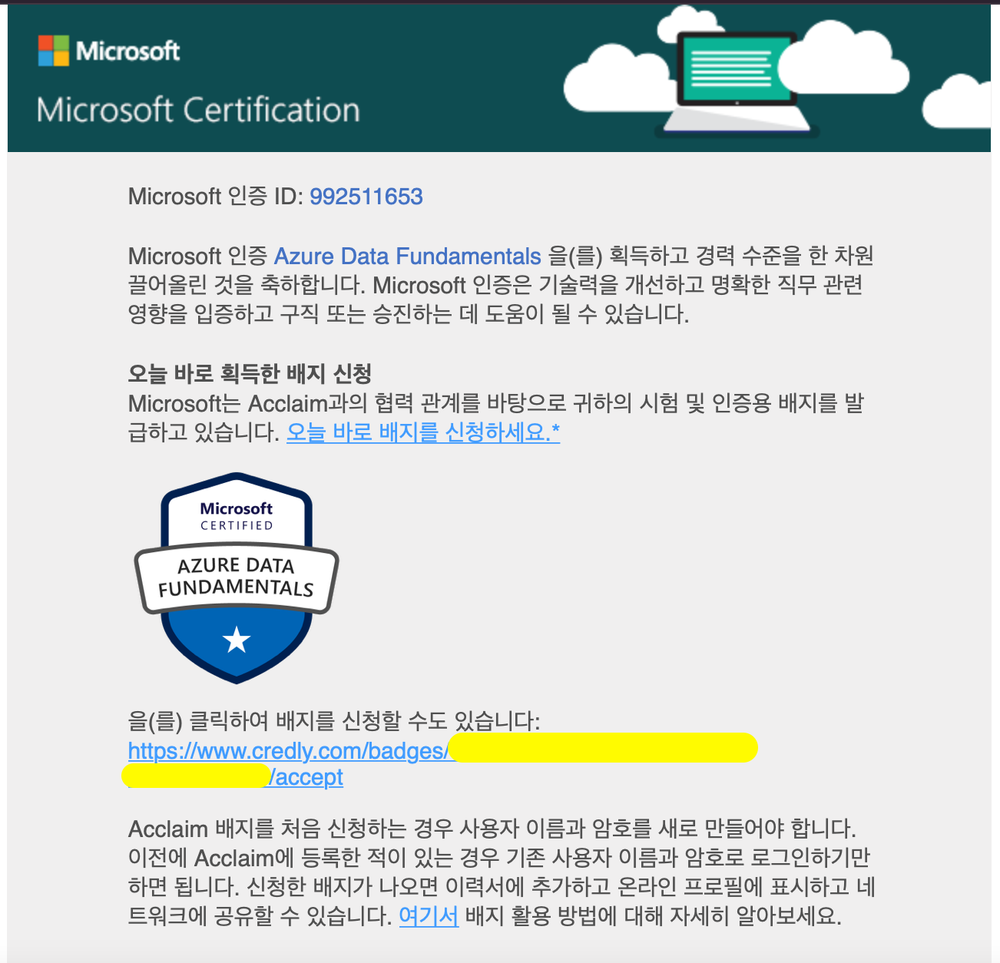

## 소감

개인적으로 이러한 자격증을 따기 위해 열공하는 것은 사비로 보는 것은 조금 아깝다고 생각은 해왔는데, Azure에서 이런 좋은 프로그램이 있어서 덕분에 Azure 간접 경험을 할 수 있어서 좋았고, 내가 깊게 알지 못했던 데이터 관련 개념을 공부할 수 있게 되어서 좋은 시간이었다.

앞으로 AI 쪽으로도 Azure 웨비나가 있으니 수강을 하고 동기부여를 팍팍 받아서 스터디를 했으면 좋겠다.

그리고 코로나 시국에 오프라인 스터디가 없어서 완전 나태해진 내 자신을 조금 잡게 된 시간이 되어서 좋았다.

[AD]

<Comment />