import Comment from '../../../components/Comment';
import PostingDate from '../../../components/PostingDate';

<PostingDate created={'2021/3/5'} modified={'2021/3/5'} />

[AD]


여기 테이블이 예제로 있다.

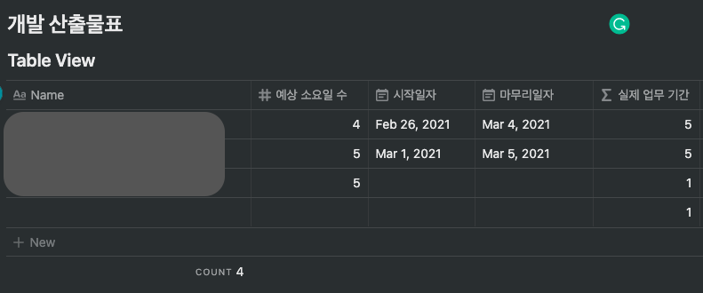

여기서 `시작일자`와 `마무리일자`를 입력받고 `주말을 제외한 실제 업무 기간`을 계산하는 함수를 써 보도록 하겠다.

### 함수 컬럼 추가하기

위에 화면을 보다시피 필자는 노션에서 페이지 안에 테이블(인라인) 으로 내용을 넣었다

함수 컬럼을 추가하려면 테이블 컬럼 가장 우측의 `+` 버튼을 눌러서 **PROPERTY TYPE**을 `Formula`로 선택한다.

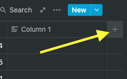

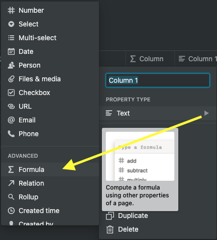

현재 이미 존재하고 있는 컬럼은 아래와 같다고 가정한다. 날짜 계산과 관련있는 컬럼만 나열하겠다.

- 시작일자 (Date Type)
- 마무리일자 (Date Type)
- **실제 업무 기간 (Formula Type)**

우리가 결과를 보아야 할 곳은 `실제 업무 기간 (Formula Type)` 컬럼이며, 여기에 함수를 써서 결과를 볼것이다.

사실 실제 업무 기간 (Formula Type) 컬럼에 함수들을 한꺼번에 넣을 수도 있지만, 그렇게 되면 함수 복잡도가 높아지고, 가시성도 떨어진다 판단하여 필자는 역할 별로 쪼개서 각 함수 컬럼에다가 조금씩 함수를 넣은 뒤 합칠 예정이다.

꼭 필자처럼 그대로 할 필요는 없고 한꺼번에 함수를 넣어도 상관 없다.

필자는 3개의 함수 컬럼(Formula Type)을 추가하도록 했다.

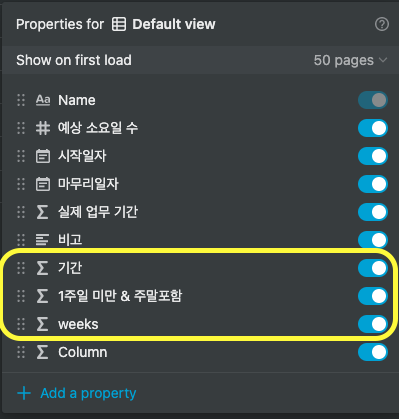

- **기간**
- **1주일 미만 & 주말포함**
- **weeks**

본격적으로 함수를 넣기 전에 노션 테이블 함수들을 잠깐 익혀보자

## 노션 테이블 함수 익히기

### 다른 컬럼의 값 참조하기

참고로 컬럼의 이름을 바꾸면 해당 컬럼을 참조하는 함수의 prop의 이름도 자동으로 따라 바뀐다

```perl
prop("마무리일자") # 다른 컬럼 값 참조할 때
```

### 기간 계산하기

`dateBetween`을 사용해서 **(끝날짜 - 시작날짜)** 개념으로 첫째 둘째 인자 순서를 넣고, 세번째 인자는 **계산을 일 수(days)로 할 지, 주(weeks)로 할 지 등을** 지정하는 부분이다.

<h4 id="calc-days">일(days)로 계산할 때</h4>

노션 테이블은 기본적으로 `월~금`을 4일로 계산한다

`월~금`을 5일로 계산 하고 싶다면, 끝에 1을 더하도록 한다

```perl
dateBetween(prop("마무리일자"), prop("시작일자"), "days") + 1
```

<h4 id="calc-weeks">주(weeks)로 계산할 때</h4>

시작일자와 마무리일자 사이가 몇 주 인지 값을 얻어낸다. **1주일 미만**이라면 `0`을 리턴한다.

```perl
dateBetween(prop("마무리일자"), prop("시작일자"), "weeks") 
```

### 일정에 주말 끼어 있을 때 주말 빼기

기간 계산을 주로 할 때, 1주일이라면 무조건 주말 2일은 붙어 있으므로 총 기간에서 `n주 * 2(days)` 개념으로 빼 주도록 한다

```perl
dateBetween(prop("마무리일자"), prop("시작일자"), "days") - dateBetween(prop("마무리일자"), prop("시작일자"), "weeks") * 2
```

### 요일 알아내기

`formatDate` 를 이용해서 두번째 인자에 `"d" 포멧`을 입력하면 무슨 요일인 지 알아낼 수 있다.

```perl
formatDate(prop("시작일자"), "d") # <- 5
formatDate(prop("시작일자"), "dd") # <- "Fr"
formatDate(prop("시작일자"), "ddd") # <- "Fri"
formatDate(prop("시작일자"), "dddd") # <- "Friday"
```

### 1주일 미만의 일정에 주말 끼어 있는 지 판별하기

아래 두 가지 조건을 만족시키도록 한다

1. `formatDate`함수의 `"d" 포멧`을 이용해서 숫자값을 얻어온 다음, **시작일자**의 요일이 **마무리일자**의 요일보다 큰 지 판별한다

    ```perl
    formatDate(prop("시작일자"), "d")
    ```

2. 시작일자와 마무리일자 사이가 몇 주 인지 값을 얻어낸다. **1주일 미만**이라면 `0`을 리턴한다.

    ```perl
    dateBetween(prop("마무리일자"), prop("시작일자"), "weeks") == 0
    ```

<p style={{height: '2rem'}}></p>
[AD]
<p style={{height: '2rem'}}></p>

## 함수 컬럼에 함수 넣어보기

### 기간

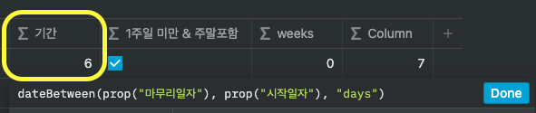

```perl
dateBetween(prop("마무리일자"), prop("시작일자"), "days")
```

### 1주일 미만 & 주말포함

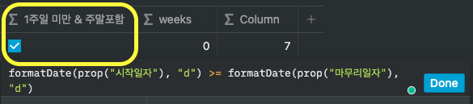

```perl
formatDate(prop("시작일자"), "d") >= formatDate(prop("마무리일자"), "d")
```

### weeks

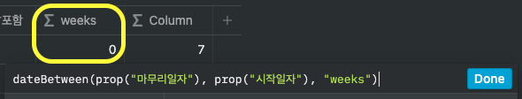

```perl
dateBetween(prop("마무리일자"), prop("시작일자"), "weeks") 
```

### 실제 업무 기간: 최종 함수 조합!

함수를 한 줄로 만들어서 복붙해야 정상 동작 되는 것 같다

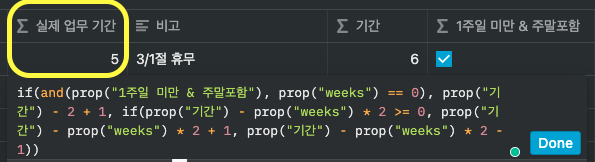

- `if` 함수와 `and` 함수를 활용했다
- 앞서서 계산했던 `1주일 미만 & 주말포함`, `기간`, `weeks` 컬럼의 값을 참조해서 최종 계산을 했다.

```perl
if(and(prop("1주일 미만 & 주말포함"), prop("weeks") == 0)
  , prop("기간") - 2 + 1
  , if(prop("기간") - prop("weeks") * 2 >= 0
    , prop("기간") - prop("weeks") * 2 + 1, prop("기간") - prop("weeks") * 2 - 1))

```

## 참조 컬럼 테이블에서 숨기기

계산할 때에만 쓰이는 함수컬럼을 숨기고 싶다면, 테이블의 세개의 점 메뉴를 눌러서 Properties 를 들어간 뒤 숨기고 싶은 컬럼의 스위치를 끄도록 한다.

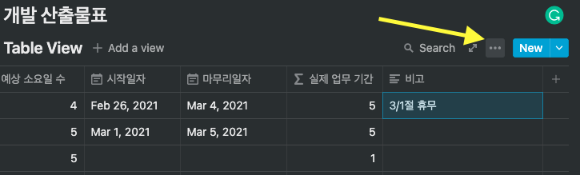

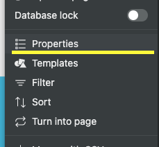

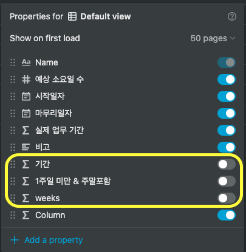


[AD]

<Comment />
