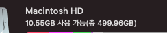
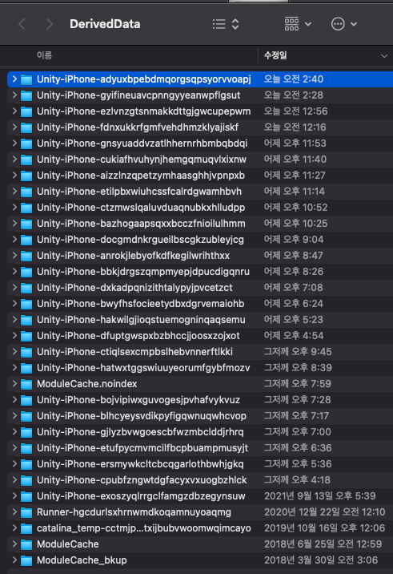
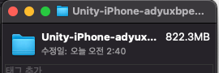
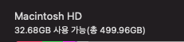

import Comment from '../../components/Comment';
import PostingDate from '../../components/PostingDate';

<PostingDate created={'2022/1/4'} modified={'2022/1/4'} />

[AD]

# npm, yarn, xcode 캐시 지우기

## npm 캐시 지우기

[참고: `npm-cache | npm Docs`](https://docs.npmjs.com/cli/v6/commands/npm-cache)

`npm cache clean` 보다는 `npm cache verify`를 쓰라고 하고 있다.

왜냐면 자칫하다가 일관성이 깨질 수 있다고 겁을 주고 있기 때문이다.

:::caution npm cache clean
**$ npm cache clean**

npm ERR! As of npm@5, the npm cache self-heals from corruption issues and data extracted from the cache is guaranteed to be valid. If you want to make sure everything is consistent, use 'npm cache verify' instead. On the other hand, if you're debugging an issue with the installer, you can use \`npm install --cache /tmp/empty-cache\` to use a temporary cache instead of nuking the actual one.

npm ERR! 

npm ERR! If you're sure you want to delete the entire cache, rerun this command with --force.

npm ERR! A complete log of this run can be found in:

npm ERR!     /Users/{유저아이디}/.npm/_logs/2021-07-24T15_54_06_248Z-debug.log

FAIL: 1
:::

:::tip npm cache verify
**$ npm cache verify**

Cache verified and compressed (~/.npm/_cacache):

Content verified: 22312 (3223880598 bytes)

Content garbage-collected: 21536 (2282956381 bytes)

Index entries: 40859

Finished in 247.112s <u>← 대략 4분 걸림</u>

:::

## Yarn 캐시 지우기

[참고: `yarn cache clean`](https://yarnpkg.com/cli/cache/clean)

:::tip yarn cache clean

$ yarn cache clean

yarn cache v1.22.0

success Cleared cache.

✨  Done in 634.80s.

:::

이후 며칠동안 npm 프로젝트를 하면서 문제가 되거나 깨지거나 로딩이 매우 오래거리는 증상은 없는 것으로 보아 이렇게 지워도 괜찮은 것 같다.

[AD]

## Xcode 캐시 지우기

Unity로 열심히 개발(씨름;)을 하고 있었는데, 갑자기 여유 공간이 30기가 이상이 넘게 확 줄어든 것을 확인 했다.

휴지통 안은 기존 iOS 빌드된 것들이 지워진 파일들이었는데 그것을 다 비워보니 3기가 정도 확보가 되었지만 이것 말고 다른 의심을 하기 시작했다.

현재 하고 있는 작업이 Xcode로 열심히 빌드중이니 Xcode의 캐시들이 많은 공간을 차지하고 있을 것이라는 합리적 의심을 하였고, 구글링을 한 결과, 아래 경로 안에 엄청난 캐시들이 숨어져 있었다.

:::info XCode DerivedData 경로
~/Library/Developer/Xcode/DerivedData
:::

위의 Xcode DerivedData 경로를 들어가 보라.

아래 이미지는 **`Unity-iPhone`**으로 시작하는 폴더들이 다 유니티에서 iOS 플랫폼으로 빌드하면서 네이밍 된 것들이다.

한 폴더 각각 조회를 해 보니 엄청난 용량의 캐시가 쌓여 있었다.

**`Unity-iPhone`**으로 시작하는 폴더들을 모두 지워 보았다.

이후 엄청난 용량이 확보되었다.

**여유공간 10GB → 32GB**

삭제하는 데에만 10분이 넘게 걸렸던 것 같다

오늘 하루만 대략 30번의 빌드를 만들어 버리는 바람에 Xcode 캐시 경로를 제대로 알게 되었다

[AD]

<Comment />
