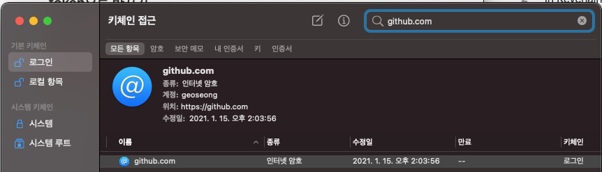
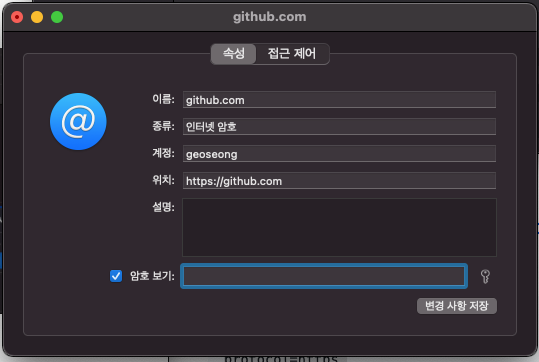
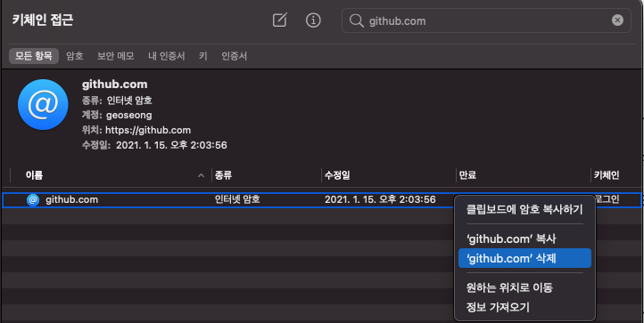

import Comment from '../../../components/Comment';
import PostingDate from '../../../components/PostingDate';

<PostingDate created={'2021/3/22'} modified={'2021/3/22'} />

[AD]


해당 포스팅은 아래 github 블로그 내용을 거의 번역한 것과 다름 없다.
[https://github.blog/2020-12-15-token-authentication-requirements-for-git-operations/](https://github.blog/2020-12-15-token-authentication-requirements-for-git-operations/)  

어느 날 아래와 같은 메일을 받았다.

:::caution You recently used a password to access the repository at geoseong/geoseong.github.io with git using git/2.24.3 (Apple Git-128).

Basic authentication using a password to Git is deprecated and will soon no longer work. Visit [https://github.blog/2020-12-15-token-authentication-requirements-for-git-operations/](https://github.blog/2020-12-15-token-authentication-requirements-for-git-operations/) for more information around suggested workarounds and removal dates.
:::

`2021년 8월 13일` 부로 GitHub.com에서 Git 작업을 인증 할 때 더 이상 `계정 암호를 허용하지 않`으며, `token-based authentication이 필요`하다고 한다

그리고 two-factor authentication을 이미 사용중인 사람이라면 해당 인증 절차 공지사항에 해당이 되지 않는단다

## 영향이 가는 워크플로우

- 커맨드 라인
- Git을 이용하는 데스크탑 어플리케이션
    - GitHub Desktop은 제외
- [GitHub.com](http://github.com) 계정에 패스워드로 바로 접속하는 모든 앱과 서비스들

## 보안 강화를 하게 된 배경
:::info 공격자들에게 갈취된 비밀번호를 다수개의 웹사이트로부터 재사용하기 더욱 어렵게 하기 위해, 그리고 해당 비밀번호로 GitHub 계정의 접근권한을 얻기 더욱 어렵게 하기 위해.
:::

위 날짜 이후로 아래와 같은 방법으로 인증을 해야만 한다

1. [personal access token](https://docs.github.com/en/github/getting-started-with-github/set-up-git#next-steps-authenticating-with-github-from-git) (개발자)
2. OAuth token
3. Github App installation token: integrators(비개발자 담당 책임?)
    1. GitHub App을 사용하기
4. SSH Key

위의 두 가지 방법은 아이디-비밀번호 인증보다 다음과 같은 이득이 있다고 한다

- **고유** – 토큰은 GitHub에 고유하며 사용 또는 장치별로 생성 될 수 있습니다.
- **취소 가능** – 토큰은 영향을 받지 않는 자격 증명을 업데이트 할 필요없이 언제든지 개별적으로 취소 할 수 있습니다.
- **제한됨** – 토큰의 범위를 좁혀 사용 사례에 필요한 액세스 만 허용 할 수 있습니다.
- **무작위** – 토큰은 정기적으로 기억하거나 입력해야하는 더 간단한 암호가 될 수있는 사전 또는 무차별 대입 시도 유형의 영향을받지 않습니다.

## 해야 할 것

개발자는

- HTTPS를 접속하기 위해 [a personal access token](https://docs.github.com/en/github/authenticating-to-github/creating-a-personal-access-token) 을 사용할 것
- 혹은 SSH key를 사용할 것

integrator(비개발자 담당 책임?)는

- [Web application flow](https://docs.github.com/en/developers/apps/authorizing-oauth-apps#web-application-flow)나 [OAuth 2.0 device authorization flow](https://github.blog/changelog/2020-07-27-oauth-2-0-device-authorization-flow/) 를 사용할 것
    - 더 상세한 가이드는 [Authorizing OAuth Apps](https://docs.github.com/en/developers/apps/authorizing-oauth-apps) 페이지 참조

필자는 개발자이기 때문에 [personal access token](https://docs.github.com/en/github/authenticating-to-github/creating-a-personal-access-token)을 만들어서 세팅해 보기로 했다.

### Personal access token 만들기

GitHub은 1년동안 사용 되지 않은 personal access token은 자동 삭제한다고 함

1. GitHub 우측상단 프로필 이미지를 눌러 메뉴룰 펼치고 Settings 를 누른다

    

2. 좌측 사이드바에서 Developer settings 를 클릭한다

    

3. 또다시 좌측 사이드바에서 Personal access tokens 를 클릭한다

    

4. Personal access tokens 헤드라인 우측에 보이는 `Generate new token` 버튼을 클릭하고, Github 에서 비밀번호를 한번 더 입력하라고 하는데, 입력 해 준다
5. 별명을 입력한다 내가 분간할 만한 설명을 쓰면 된다

    

6. 아래 항목들 중에서 허용하고자 하는 역할만 체크 한 후 `Generate token`버튼을 누르도록 한다

    

7. 새로 생성된 token값을 복사한다. 보안적인 이유로 해당 페이지를 벗어나면 다시는 token을 다시 볼 수 없으므로 잘 보관하고 있도록 한다

    

<p style={{height: '2rem'}}></p>
[AD]
<p style={{height: '2rem'}}></p>

### 신규: 커맨드로 Github 리포지토리 clone 해 보기

Password 입력 란에다가 방금 생성한 personal access token을 넣고 리포지토리를 clone 해 본다.

```bash
$ git clone https://github.com/geoseong/geoseong.github.io.git
Username: your_username
Password: your_token
```

### 기존: 리포지토리에 존재하던 비밀번호 세팅를 personal access token으로 바꾸기

참고 문서: [Updating credentials from the macOS Keychain](https://docs.github.com/en/github/using-git/updating-credentials-from-the-macos-keychain)

OSX 기준으로 설명하도록 하겠다.. 필자는 맥북을 쓰고 있으므로 😸

`키체인 접근(keychain access)` 앱을 실행한다.


우측상단 검색란에 github.com 이라고 입력한다



더블클릭 해서 `속성` 탭의 `암호보기`에 체크를 해서 osx 로그인 암호를 입력 한 후, 기존에 채워져있던 비밀번호를 지우고 personal access token으로 채운 뒤 `변경 사항 저장` 을 누른다.



아니면 깔끔하게 지우고 싶다면 제거한다



### 커맨드를 이용하여 keychain 지우기

아래 커맨드로 성공적으로 지워졌다면 아무런 내용도 출력되지 않을 것이다.

```bash
$ git credential-osxkeychain erase
host=github.com
protocol=https
> [Press Return]
```

## 커맨드로 GitHub API 접근 시 기존과 달라지는 점

**기존 방식**

```bash
curl -u my_user:my_password https://api.github.com/user/repos
```

**[personal access token](https://help.github.com/en/github/authenticating-to-github/creating-a-personal-access-token-for-the-command-line) 을 사용할 때**

```bash
curl -H 'Authorization: token my_access_token' https://api.github.com/user/repos
```

**OAuth Apps**

에서는 [web application flow](https://developer.github.com/apps/building-oauth-apps/authorizing-oauth-apps/#web-application-flow) 으로 OAuth token을 생성시켜서 oauth token으로 로그인 하도록 한다

```bash
curl -H 'Authorization: token my-oauth-token' https://api.github.com/user/repos
```


[AD]

<Comment />
