import Comment from '../../components/Comment';
import PostingDate from '../../components/PostingDate';

<PostingDate created={'2021/4/7'} modified={'2021/4/7'} />

[AD]


## Bolt 소개

[Unity Blog : Bolt 비주얼 스크립팅 에셋 무료화 안내](https://blogs.unity3d.com/kr/2020/07/22/bolt-visual-scripting-is-now-included-in-all-unity-plans/)

:::tip [Unity Blog](https://blogs.unity3d.com/kr/2020/07/22/bolt-visual-scripting-is-now-included-in-all-unity-plans/)
Bolt를 사용하면 `코드를 작성하지 않고 게임이나 앱의 로직을 만들 수 있습니다.`
Bolt에는 노드 기반의 시각적 그래프가 있어서 프로그래머와 비프로그래머 모두가 최종 로직을 설계하고 `빠르게 프로토타입을 만들 수 있습니다`. 또한 프로그래머를 위한 기능으로, 고급 작업을 하거나 다른 팀원들을 위해 커스텀 노드를 만드는 데 사용할 수 있도록 API도 포함되어 있습니다.
:::

본래 Ludiq라는 회사에서 Bolt를 갖고 있었으나, Unity측에서 Bolt를 인수했다고 하며(회사 자체를 인수하지는 않음), 현재 [Unity Asset Store](https://assetstore.unity.com/packages/tools/visual-scripting/bolt-163802?_ga=2.80852055.1159164947.1615564938-1282061146.1595260192)에서 무료로 사용 해 볼 수 있다.

**Bolt 개발문서**

[Unity Docs: Bolt Visual Scripting 1.4.13](https://docs.unity3d.com/bolt/1.4/manual/bolt-documentation.html)

## Bolt 셋업

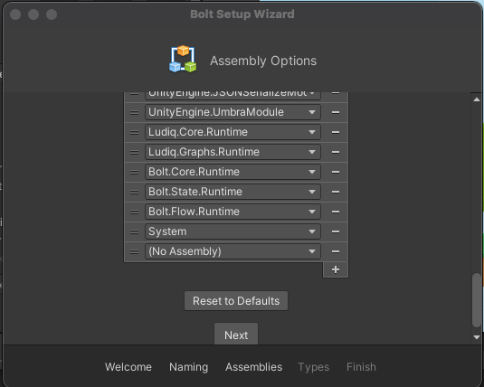

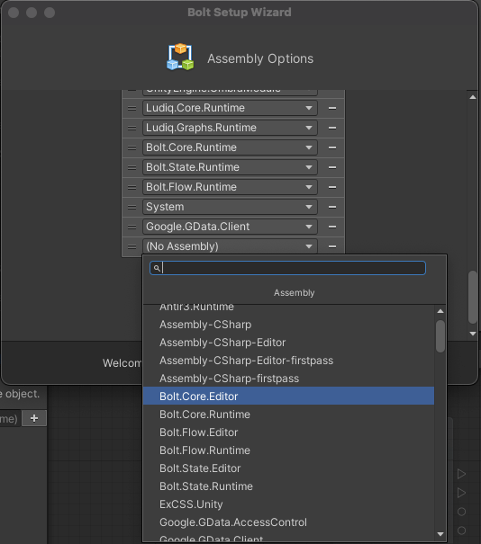

볼트를 셋업할 때 어셈블리 옵션에서 3rd party 플러그인을 추가 할 수가 있는데, `DLL파일 단위`로 어셈블리 추가가 가능하다

플러그인의 `DLL파일`을 현재 Unity 프로젝트 안의 Assets폴더 안에 집어넣으면 Assembly에서 리스트가 나온다

커스텀 타입(class, struct) 을 추가 할 수 있다고 한다

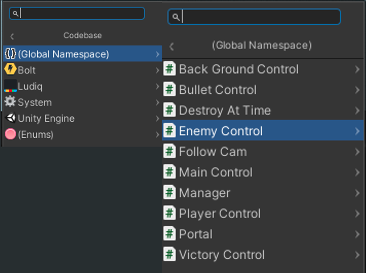

Unity의 객체 클래스(Mono Behaviours, Scriptable Objects)를 상속받은 직접 구현한 클래스들은 자동으로 Bolt에서 사용 가능하며, Flow Graph에서 새로운 유닛을 추가할 때 `{Global Namespace}` 카테고리 안에서 확인 할 수가 있다.

## Unity Bolt 컴포넌트 종류

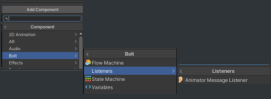

- Bolt
    - Flow Machine
    - State Machine
    - Variables
    - Listeners → Animator Message Listener

주로 쓰이게 될 컴포넌트는 `Flow Machine`이다.

기존에 C#으로 짜던 코드를 다이어그램으로 그대로 옮겨서 작업할 수 있는 컴포넌트가 Flow Machine이며, 해당 컴포넌트에서 `Edit Graph`를 누르면, Flow Graph 윈도우에서 작업을 할 수가 있다.

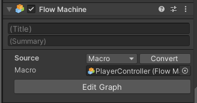

참고로 Graph 윈도우를 따로 호출하려면 Unity메뉴의 `Window → Graph`이다.

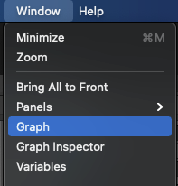

## Variables

Variables 컴포넌트는 Flow Machine으로 Graph를 작업 할 때 이용 할 수 있는 변수를 정의하는 곳이다.

변수(Variables) 타입은 아래와 같이 존재한다

- `Graph`: 해당 그래프에서만 사용할 수 있는 지역변수
- `Object`: 해당 GameObject 내부에서 공유해서 사용 가능한 변수
- `Scene`: 현재 열려있는 Scene 내부에서 공유해서 사용 가능한 변수
- `App`: 해당 앱이 열려 있는 한 Scene을 막론하고 전역변수로 사용 가능 (=싱글톤 패턴의 구현)
- `Saved`: 로컬스토리지의 역할을 기대

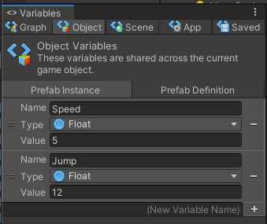

## Flow Graph

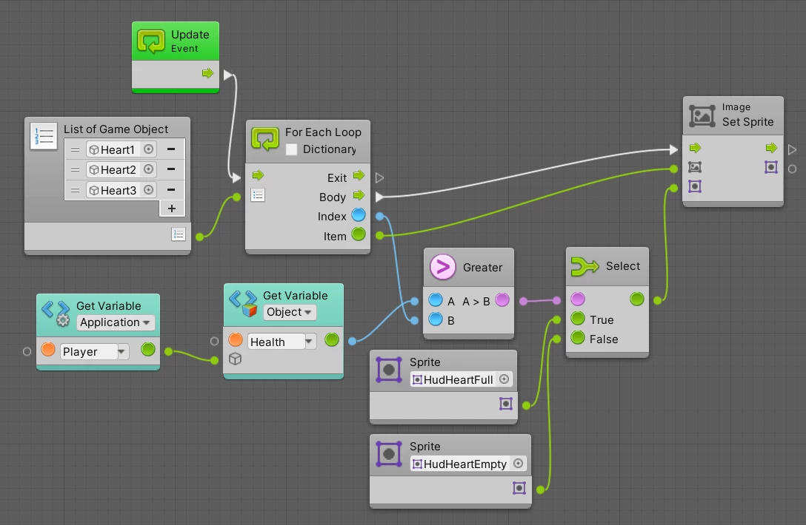
분기(Branch: true/false)나, 비교(Compare: A>B, A==B, ...), 반복문(loop), Math 등의 low-level 로직을 그래프로 만들 수 있다

### Flow Machine 소스 만들기: Macro or Embed

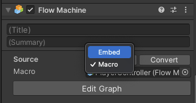

`Flow Machine`(**Machine**: GameObject에 들어가는 컴포넌트)을 통하여 Flow Graph를 만들게 되는데, 두 가지 타입으로 소스를 만들 수 있다.

일반적인 케이스들은 Macro가 Embed보다 장점이 많다

[Embed vs Macro 소스 비교표](https://docs.unity3d.com/bolt/1.4/manual/bolt-graphs-machines-macros.html#embeds-vs-macros)가 공식문서에 게재되어 있다.

<h4>Macro vs Embed</h4>

| 비교항목 | Macro | Embed |
| ---- | ------- | ------- |
| 재사용 | `O`, 다른 컴포넌트에서 재사용 가능 | `X`, 컴포넌트에만 물려있음 |
| 파일로 보관 | `O` | `X` |
| Prefab과 함께 사용 | `O` | `X` |
| Scene 레퍼런스 사용 | `X` | `O` |
| Play모드에서 변경한 내용 저장 | `X` | `O` |
| Scene 내 객체를 그래프에 가져오기 | `X` | `O` |

### Embed ↔ Macro Convert하기

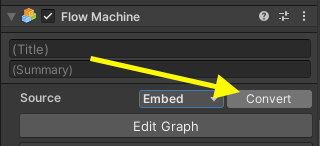

또한 `Macro` 소스를 만들고 나서 내용변화 없이 그대로 `Embed`로 변환이 가능하고, `Embed`에서 `Macro`로도 변환이 가능하다

### Super Unit

Flow Graph 안에서 재사용 가능하도록 모듈화를 한 Flow Graph이다

Input과 Output 플로우를 매뉴얼하게 설정이 가능하다

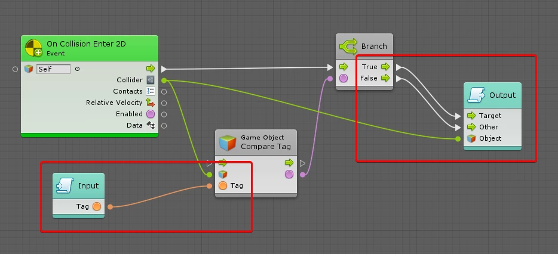

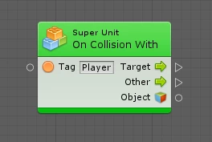


<p style={{height: '2rem'}}></p>
[AD]
<p style={{height: '2rem'}}></p>


## State Graph

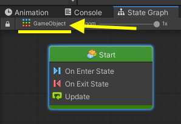

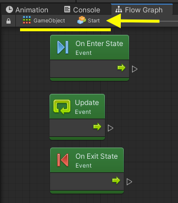

Flow Graph의 Animator 버전이라고 이해하면 이해가 쉽지 않을까 생각한다.

만들어 놓은 여러 State들 사이의 흐름을 왔다갔다 제어하는 `Transition` 개념이 존재한다.

또한 State Graph의 State는 3가지가 존재하는데,

- Flow State
- Super State
- Any State

이렇게 서술한 `Transition`과 `Any State`의 개념들은 Animator와 같은 개념을 공유하고 있다.

참고로 위 스샷의 **Start 객체**는 [Flow State](https://docs.unity3d.com/bolt/1.4/manual/bolt-states.html#flow-states) 이며, Flow State만의 라이프사이클인 `OnEnterState`, `OnExitState`을 이용해서 State가 날아왔을 때 로직을 제어할 수 있다.

### Flow State

두 개의 Flow State를 만들고 그 두 State의 상호작용을 하는 Transition을 작업 해 보았다.

이 작업은 [Unity Learn: Platformer Tutorial → Health & Damage → 4.Create the player health state machine](https://learn.unity.com/tutorial/health-damage?uv=2019.3&projectId=5ea809f0edbc2a00215f1fa5#5ea955ccedbc2a0623346870) 챕터를 보면서 따라했다.

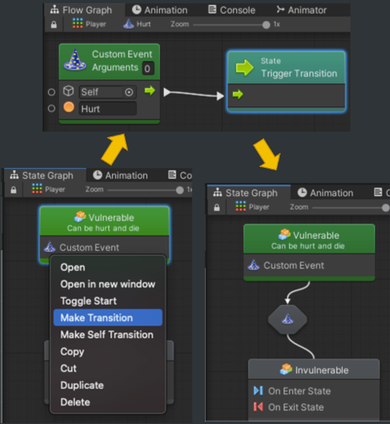

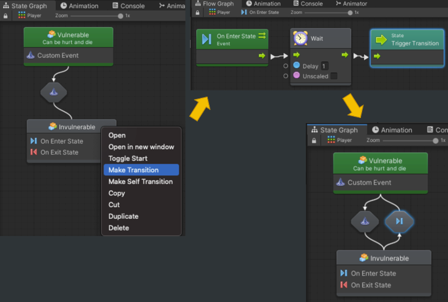

### Coroutine 옵션

On Enter State 의 정보에서 `Coroutine` 옵션을 우연히 발견했다. Coroutine도 지원을 하나보다. 나중에 Coroutine을 Bolt에서 제대로 함 해봐야지..

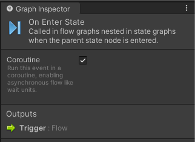

### Super State

Flow Graph의 Super Unit과 같은 개념으로, nested하게 State Graph를 관리할 수 있다.

## 스크립팅

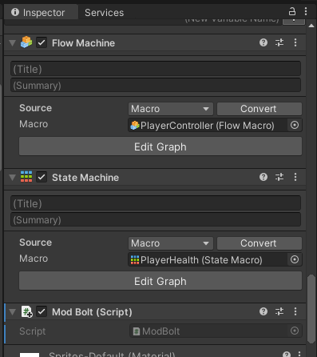

Flow Machine 컴포넌트가 있는 GameObject에다가 새로 스크립트 컴포넌트를 추가해서 실습을 진행해 보았다.

### Variables API


Variables 컴포넌트의 5가지 타입을 코드로 불러오고 수정이 가능하다.

```csharp
using UnityEngine;
using Bolt;

public class ModBolt : MonoBehaviour
{
    void Start()
    {
        Debug.Log("[Variable API]");

        // Object Variable
        //VariableDeclarations declarations = Variables.Object(this);
        Debug.Log("--- Object Speed : " + Variables.Object(this).Get<int>("Speed"));

        // Scene Variable
        Debug.Log("--- Scene scenename : " + Variables.ActiveScene.Get<string>("scenename"));

        // Application Variable
        Variables.Application.Set("app", "hi!!");
        Debug.Log("--- Application app : " + Variables.Application.Get<string>("app"));

        // Saved Variable
        Variables.Saved.Set("app", "saved!!");
        Debug.Log("--- Saved saveddd : " + Variables.Saved.Get<string>("saveddd"));

        // 정의 되어 있나 체크: check if is it defined
        Debug.Log("--- Object variables(notdefinedvar) defined? " + Variables.Object(this).IsDefined("notdefinedvar"));
    }
}
```

Variable 타입에 따른 변수들을 가져오고(`Get`) 수정(`Set`)하는 것이 가능하고 정의가 되어 있는 지 확인하는(`IsDefined`) 메소드가 존재한다.

그리고 정의되지 않은 변수에 접근하려고 하면, 유니티 콘솔에서 Exception 을 뱉는다. 

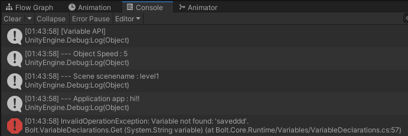

### Variables API → Graph Variable 사용법이 까다롭군

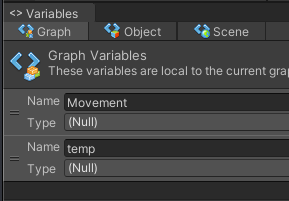

이 놈은 쓰는 과정이 참 까다로웠다.

해당 스크립트를 물고 있는 GameObject의 Flow Machine을 GetComponent로 받아오는 과정을 알아내는 과정에서 약간의 허들이 있었다.

이 부분은 공식 문서의 설명이 불친절하다...

```csharp
using UnityEngine;
using Bolt;
using Ludiq;

public class ModBolt : MonoBehaviour
{
    void Start()
    {
        // ...
        // Graph Variable
        FlowMachine flowMachine = GetComponent<FlowMachine>();
        var graph = GraphReference.New(flowMachine, true);

        Debug.Log("--- Graph Movement : " + Variables.Graph(graph).Get<object>("Movement"));
    }
}
```

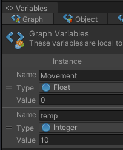

### Events API

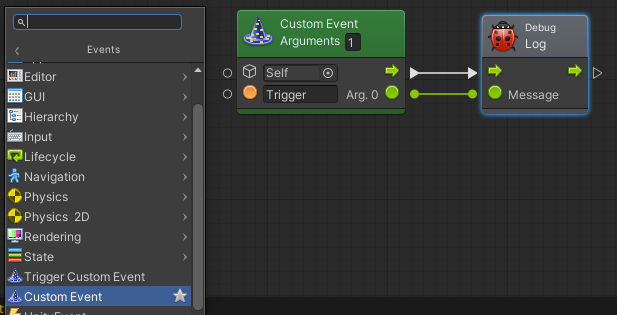

Graph에서 `Event → Custom Event` 라는 Unit을 추가하게 되면 네이밍을 지정하여 로직대로 그래프를 그려놓고 호출을 시킬 수가 있는데, 이 정의된 Custom Event 호출을 [Events API](https://docs.unity3d.com/bolt/1.4/manual/bolt-events.html)를 이용해서 할 수가 있다.

예를 들어 위 사진처럼 `Trigger` 이름으로 명명된 Debug.Log를 유니티 콘솔에 뿌리는 로직을 가진 Custom Event를 정의하고, Events API를 이용하여 호출을 해 보겠다.

```csharp
using UnityEngine;
using Bolt;

public class ModBolt : MonoBehaviour
{
    void Start()
    {
        Debug.Log("[Variable API]");

        // Events API
        // Trigger(GameObject, {Event Name}, {Argument1}, {Argument2}, ...);
        CustomEvent.Trigger(gameObject, "Trigger", "called by Events API!!");
    }
}
```

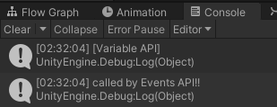

## 버전관리 툴 동시 사용 시 ignore할 파일

Git이나 Unity Collab, SVN 등의 버전관리 툴을 사용하게 된다면 Bolt 관련 패키지 파일들을 무시하는 가이드가[Bolt Documentation: Version Control](https://docs.unity3d.com/bolt/1.4/manual/bolt-version-control.html) 문서에 친절하게 설명이 되어 있다.

여기다가 직접 파일 리스트를 쓸 수도 있지만, 공식 문서의 내용이 언제 휙휙 바뀔 지 모르니 링크로 대신하도록 하겠다.

## 볼트 사용 예제

<iframe src="https://www.youtube.com/embed/aQceChK-kC4" frameBorder="0" allowFullScreen width="100%" height="400px"></iframe>

<iframe src="https://www.youtube.com/embed/6ikMXKFk" frameBorder="0" allowFullScreen width="100%" height="400px"></iframe>

## 공식 튜토리얼 강좌


[Unity Learn: Platformer Tutorial](https://learn.unity.com/project/bolt-platformer-tutorial)

- Unity 공식 강좌
- 유니티 계정이 있다면 로그인해서 중간 진도 체크가 가능하다
- 똑같이 따라 해 보면서 Bolt의 대부분의 기능들을 접할 수 있다

## 아쉬운 점

### 디버깅

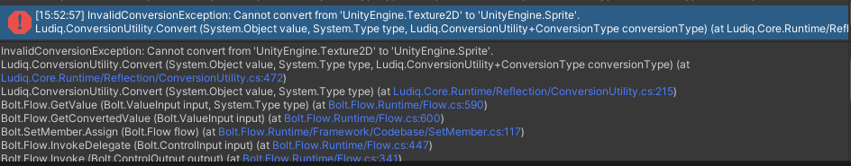

Flow Graph를 신나게 그리고 나서 내용이 엄청 많아질 경우에 에러가 발견되면, 정확히 어디 위치에 에러인 지 콘솔에서 확인할 길이 없는 것 같다. 감으로 잡아내야 한다.

스크립트에서 에러가 나면 저 파란색 글씨를 클릭하면 어디 cs파일의 몇번 라인이 문제인 지 정확히 집어낼 수 있는데 말이다..

## 내가 받는 느낌

앞으로 하게 될 유니티 프로젝트의 구상에 무조건 Bolt가 들어가게 될 것 같다.

Bolt를 이 프로젝트에 사용해 보았을 때 100% 커버가 가능 할 지 실험을 해 볼 것 같으며,

스크립트만 추적하면서 눈의 피로와 머리지끈거림이 덜해 지면서 생산성이 올라갈 것만 같은 느낌이 든다.

그치만 지금은 어디까지나 사용 초기에 훑어보기를 위한 과정에서 포스팅을 하는 것이기 때문에 이상적인 생각만을 할 뿐이고 나중은 어찌 될 지는 모르겠다

그치만 Unity공식에서 이 패키지를 팍팍 밀어줄 거라는 점은 아주 고무적인 것 같다.


[AD]

<Comment />
